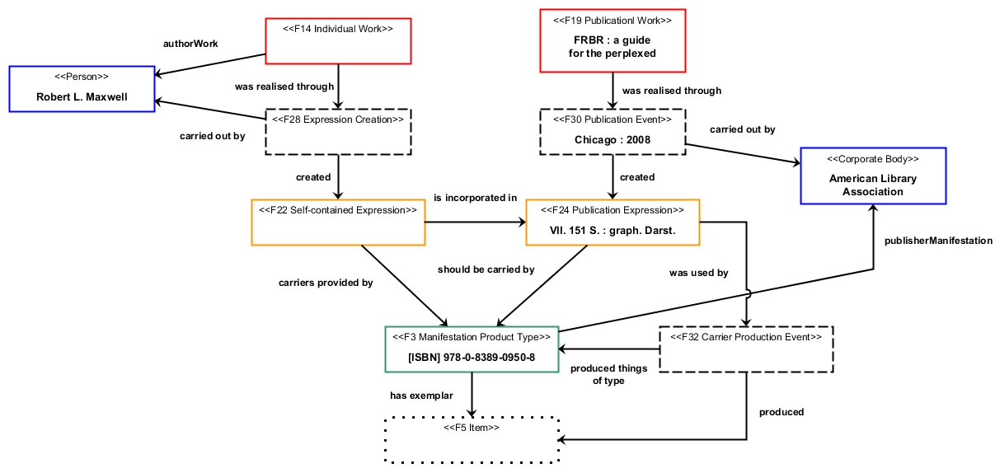

# Beispiel: FRBRoo für Einzelwerke / Example: FRBRoo for Individual Works

Veröffentlicht am 16. Februar 2013 von Hans-Georg Becker	

\
The LODLAM Mercury von Hans-Georg Becker steht unter einer Creative Commons Namensnennung 4.0 Unported Lizenz.

***

Beispiel für / Example for: [FRBRoo — Eine prozessorientierte Sicht auf bibliographische Informationen](frbroo-eine-prozessorientierte-sicht-auf-bibliographische-informationen.md)

**FRBR : a guide for the perplexed / Maxwell, Robert L.**\
Chicago: American Library Association, 2008.\
VII, 151 S. : graph. Darst.\
ISBN: 978-0-8389-0950-8, 0-8389-0950-7

**Graphische Darstellung / graphical representation**

Mögliche RDF-Darstellung / representation in RDF

siehe / see: [example1.ttl](https://github.com/hagbeck/liblab/blob/master/data/examples/example1.ttl)
