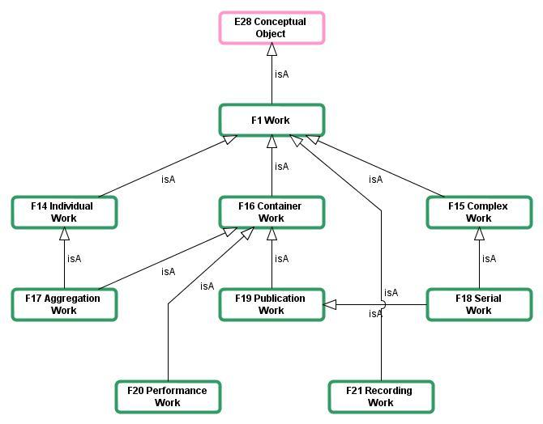
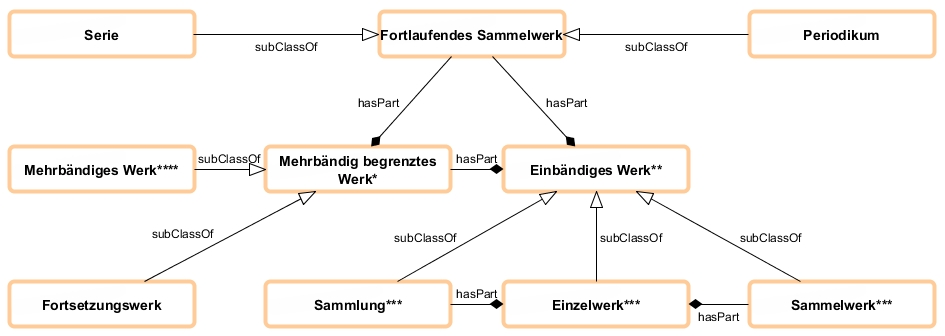
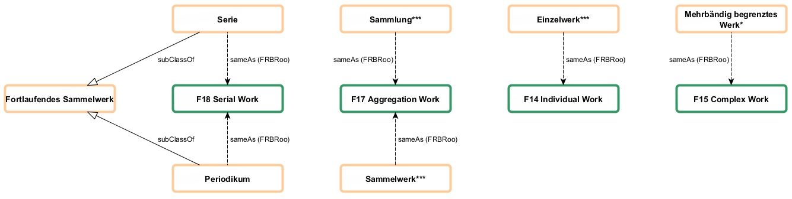
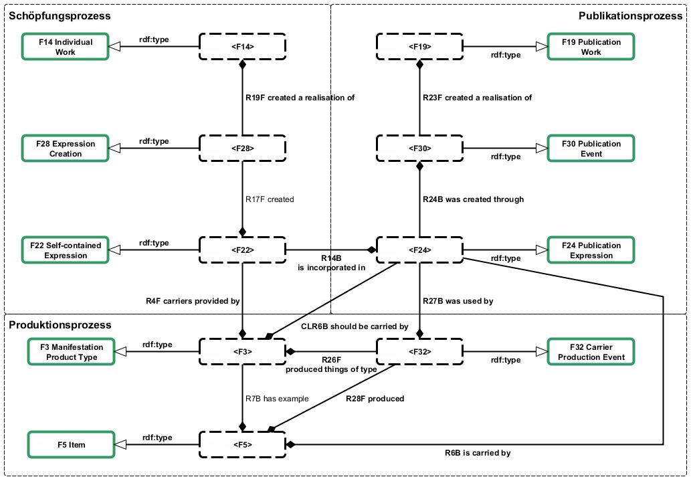
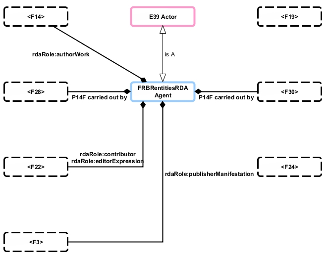

# FRBRoo - Eine prozessorientierte Sicht auf bibliographische Informationen

Posted on 16. Februar 2013 by Hans-Georg Becker	

Nachdem ich in [FRBRoo — eine Anwendung](../15/frbroo-eine-anwendung.md) meine Motivation in Bezug auf FRBRoo erläutert habe, werde ich im Folgenden die Publikationsformen mithilfe der FRBRoo dargestellen. Dabei stützt sich die Modellierung vor allem auf die Ereigniszentriertheit des CRM, wodurch die Schöpfungs-, Publikations- und Produktionsprozesse transparenter werden.

Für den Fall, dass der geneigte Leser die Definitionen der Publikationsformen nicht mehr so ganz auf dem Schirm hat, stelle ich sie nochmal kurz unter Verwendung des “Bibliothekrischen Grundwissens” von Ganter/Hacker vor.

* Einzelwerk\
  Ein Einzelwerk ist eine in sich geistige abgeschlossene Schöpfung, die zur zusammenhängenden Veröffentlichung vorgesehen ist und in einem oder mehreren Teilen erscheint.
* Sammlung\
  Als Sammlung wird eine Veröffentlichung bezeichnet, in der zwei oder mehr Einzelwerke desselben Verfassers vereinigt sind.
* Sammelwerk\
  Unter Sammelwerk versteht man ein Buch mit mindestens zwei Einzelwerken von zwei oder mehr Verfassern.
* Fortsetzungswerk\
  Fortsetzungswerk nennt man eine mehrbändige Publikation, bei der die einzelnen Bände oder Teile nacheinander in zeitlichen Abständen
* Fortlaufende Sammelwerke\
  Wenn in mehreren Teilen erscheinende Sammelwerke keinen von vornhinein geplanten Abschluss haben, sondern […] ohne Begrenzung der Band- oder Heftzahl erscheinen, nennt man sie fortlaufende Sammelwerke. Dazu zählen Schriftenreihen (Serien) und Periodika (Zeitungen, Zeitschriften, zeitschriftenartige Reihen).

Die zentrale Rolle beim Mapping mit den FRBRoo stellt die Verfeinerung des Werk-Begriffs der FRBR dar.
Die Ausführungen in den originalen FRBR zu den Gruppe-1-Entitäten lassen in einigen Fällen verschiedene Interpretationen zu, die in Teilen zu logischen Inkonsistenzen führen. Insbesondere die Entität Work deckt mehrere Szenarien ab, die in der Realität verschiedene Eigenschaften haben. Die FRBRoo greifen diese Ungenauigkeit auf und definieren das Work als Superklasse und verfeinern diese dann durch Work-Begriffe, welche die verschiedenen Szenarien modellieren können.

So entsteht beispielsweise eine Entität Serial Work, die zum einen den intellektuellen Anteil des Verlags berücksichtigt (Publication Work) und zum anderen eine Umgebung für die Aggregation anderer Werke bildet (Complex Work). Dabei ist die soeben genannte Aggregation nicht mit der Aggregation bei Sammelwerken zu verwechseln. Letztere findet auf der Ebene der Expressions statt. In den FRBRoo heißt es zu Aggregation Work:

>    This class comprises works whose essence is the selection and/or ar-rangement of expressions of one or more other works. This does not make the contents of the aggregated expressions part of this work, but only part of the resulting expression. `F17 Aggregation Work` may include additional original parts.

Somit fallen hierunter die Sammelwerke und Sammlungen.

Legt man nun die Publikationstypen nach dem bibliothekarischen Standardwerk von Gantert/Hacker zugrunde, so ergibt sich für die Publikationstypen das folgende Bild. Die Abbildung enthält zwei Typen von Relationen: Unter-/Oberklassen (subClassOf) und Teil/Ganzes-Beziehungen (hasPart). Letztere stellen dabei – die insbesondere im deutschen Bibliothekswesen starken – Verknüpfungen zu Überordnungen dar.

Diese Abhängigkeiten lassen sich nun auf die FRBRoo-Entitäten abbilden, wobei sich Publikationsformen FRBRoo-Entitäten “teilen”. Am Beispiel des fortlaufenden Sammelwerks sind dies die Serie/Reihe und das Periodikum, welche sich das Serial Work teilen. Der formale Unterschied zwischen Serien und Periodika ist “nur” die Beschreibung der Erscheinungsweise. Diese kann aber in einem Modell, wie es die FRBRoo sind, durch die Verwendung entsprechender Vokabulare für die Attribute der Entitäten beschrieben werden.

**Einzelwerke und die Akteure der Prozesse**

Das CRM und somit die FRBRoo liefern durch ihre Ereigniszentriertheit für das Modell drei wesentliche Prozesse: den Schöpfungsprozess (realisiert durch das Ereignis `F28 Expression Creation`), den Publikationsprozess (realisiert durch das Ereignis `F30 Publication Event`) und den Produktionsprozess (realisiert durch das Ereignis `F32 Carrier Production Event`).
Die Beschreibung des Publikationstyps Einzelwerk stellt in einem gewissen Sinne ein Kernmodell dar. So werden darin die grundsätzliche Unterscheidung und die Zusammengehörigkeit der oben genannten Prozesse sichtbar. Die in diesen Prozessen verwendeten Entitäten und Relationen werden bei sämtlichen Publikationstypen wieder verwendet und den Gegebenheiten angepasst. Der Übersichtlichkeit halber wird das Modell in zwei Teilen präsentiert: dem Modell für die materiellen Konzepte und die Ereignisse sowie dem Modell der Akteure.

Die Linien der Schöpfungs- und Publikationsprozesse verbinden sich auf der Ebene der Expressions. Hier wird der Tatsache Rechnung getragen, dass der Verlag durch das Hinzufügen seines Layouts und sonstiger, ergänzender Teile die Expression und somit die Realisierung des Schöpfers anreichert. Diese erweiterte Expression wird dann in den Produktionsprozess weitergeleitet.

Aus der Sicht eines Bibliothekskatalogs sind in der Regel zum Schöpfungsprozess des Werks wenige bis keine Informationen bekannt. Die formalen Beschreibungen der Werksebene werden im Bibliothekskontext entsprechend auf der Seite des Publikationsprozesses abgelegt, d.h. insbesondere, dass der Titel, so wie er bei der formalen Erschließung erfasst wird, als Attribut zum `F19 Publication Work` gehört. Anders ist das bei der Zuordnung der Akteure des Schöpfungsprozesses. Hier ist bei der formalen Erschließung bekannt, dass die angegebenen Personen oder Körperschaften an der Realisierung der Expression mitgewirkt haben.

Die Akteure werden in dem vorliegenden Modell zum einen als Ausführende direkt an die Ereignisse angebunden (unter Verwendung der Relation `P14 carried out by` des CRM), zum anderen werden die Rollen der Akteure mithilfe des [RDA-Vokabulars](http://rdvocab.info/) modelliert. (Das CRM liefert selber auch eine Möglichkeit, den Ausführenden eines Ereignisses eine Rolle zuzuordnen. Und zwar sieht das CRM eine Relation `P14.1 in the role of` der Relation `P14 carried out by` vor. Dieses Konstrukt ist in dieser Form aber nicht RDF-konform und müsste durch die Modellierung eines sogenannten Blank-Nodes aufgelöst werden. Da die Verwendung von Blank-Nodes in der Praxis nicht unbedingt empfohlen wird (Vgl. z.B. Heath, Tom u. Christian Bizer: Linked Data. Evolving the web into a global data space. 1. Aufl. San Rafael, Calif: Morgan & Claypool 2011, 2.4.1) und das Bibliothekswesen mit den RDA eine geeignete Alternative hat, wird diese hier auch verwendet.)

Die Abbildung zeigt die Verwendung eines weiteren Modells, den [FRBRentitesRDA](http://rdavocab.info/uri/schema/FRBRentitiesRDA). <mark>LINK DEFEKT</mark> Hierbei handelt es sich um die Definition der FRBR-Entitäten aus dem RDA-Modell. An dieser Stelle soll nun die Verbindung der Modelle genauer aufgezeigt werden.
Die FRBRoo greifen wie oben erwähnt die Schwachstellen der FRBR auf und versuchen diese zu beheben. Dabei verlassen sie aber nie das Grundvokabular der FRBR-Entitäten. So bleiben die Entitäten Work, Expression, Manifestation und Item in FRBRoo erhalten und bekommen nur die CRM-typische Nummer verliehen. Auch die RDA basieren auf den Konzepten der FRBR. Somit sind die vier Entitäten der FRBR-Gruppe 1 in allen drei Modellen äquivalent bzw. im Fall von F3 Manifestation-Product Type und F4 Manifestation Singleton in FRBRoo abgeleitet. Diese Feststellung ist insofern wichtig, dass es nur dann möglich ist, Relationen und Attribute aus verschiedenen Modellen und Ontologien zu benutzen, wenn die Entitäten in der beschriebenen Weise zusammenpassen.

In der hier vorgestellten Modellierung werden die Entitäten der FRBRoo mit denen der FRBRentitiesRDA „gematcht“, um nicht sämtliche Metadaten zu den Instanzen als CRM oder FRBRoo-Tripel zu beschreiben, was den Graph in seiner Größe förmlich explodieren ließe. Der Vorteil hierbei ist, dass ab einer bestimmten Tiefe des Graphen nur noch bereits bekannte und hoffentlich standardisierte Metadaten verwendet werden.
Verwendet man nur das CRM, so müssen für Aussagen sehr viele Tripel erzeugt werden, bis die Semantik klar ausgedrückt wird, wodurch sehr große Graphen entstehen. Um diese Graphen kleiner zu halten, wird mittels Ontology Alignement ein Mapping zu Modellen erzeugt, die für die gleiche Aussagekraft kürzere Wege erlauben. So entsteht ein durch das CRM zusammengehaltener Graph, dessen Knoten durch fachspezifische Ontologien beschreiben werden.
Auch Mazurek, Cezary et al. berichten in ihrem Beitrag [“From MARC21 and Dublin Core, through CIDOC CRM. First Tenuous Steps towards Representing Library Data in FRBRoo.“](http://www.cidoc2012.fi/en/File/1611/mazurek.pdf) <mark>LINK DEFEKT</mark> von dieser Problematik. Sie zeigen in ihrem Beitrag an einem Beispiel, wie kleinteilig diese Art der Modellierung wäre.

Das bisher beschriebene Modell soll durch ein [Beispiel](2013/02/16/beispiel-frbroo-fuer-einzelwerke.md) verdeutlicht werden.

In den nächsten Beiträgen zeige ich dann, wie das bei Sammelwerken, Sammlungen und den zugehörigen Beitragen sowie bei mehrbändig begrenzten Werken aussieht.

Weiterlesen: [Sammelwerke, Sammlungen, mehrbändig begrenzte Werke und FRBRoo](../17/sammelwerke-sammlungen-mehrbaendig-begrenzte-werke-und-frbroo.md)

