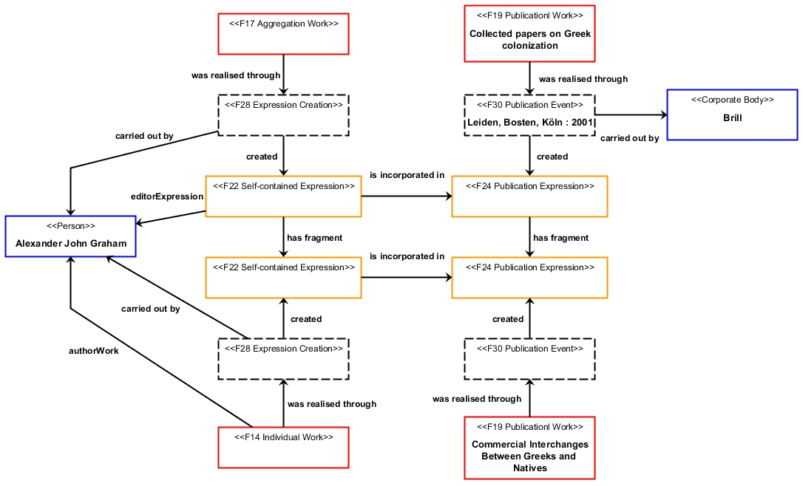

# Beispiel: FRBRoo für Sammelwerke und Sammlungen / Example: FRBRoo for Aggregation Works

Posted on 17. Februar 2013 by Hans-Georg Becker	

Beispiel für / Example for: [Sammelwerke, Sammlungen, mehrbändig begrenzte Werke und FRBRoo](sammelwerke-sammlungen-mehrbaendig-begrenzte-werke-und-frbroo.md)

**Commercial Interchanges Between Greeks and Natives / Graham, Alexander John**\
In: Collected papers on Greek colonization / Graham, Alexander John (Hrsg.)\
Leiden, Boston, Köln : Brill, 2001.

**Graphische Darstellung / graphical representation**

**Mögliche RDF-Darstellung / representation in RDF**

siehe / see: [example2.ttl](https://github.com/hagbeck/liblab/blob/master/data/examples/example2.ttl)
