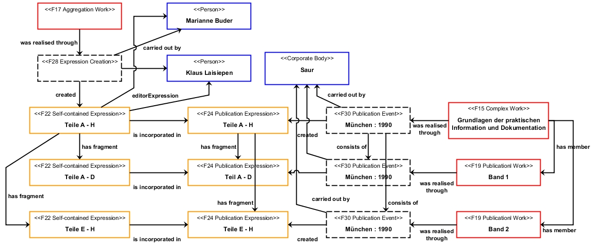
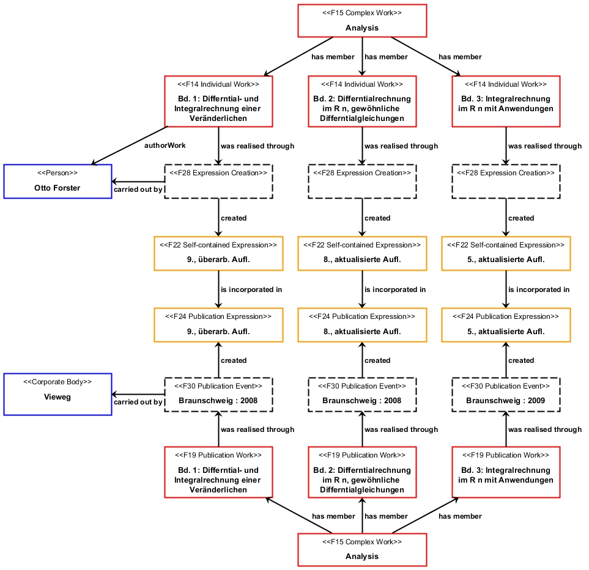

# Beispiele: FRBRoo für mehrbändig begrenzte Werke / Examples: FRBRoo for Multivolume Works

Veröffentlicht am 17. Februar 2013 von Hans-Georg Becker	

\
The LODLAM Mercury von Hans-Georg Becker steht unter einer Creative Commons Namensnennung 4.0 Unported Lizenz.

***

Beispiele für / Examples for: [Sammelwerke, Sammlungen, mehrbändig begrenzte Werke und FRBRoo](beispiele-frbroo-fur-mehrbaendig-begrenzte-werke-examples-frbroo-for-multivolume-works.md)

**Grundlagen der praktischen Information und Dokumentation : ein Handbuch zur Einführung in die fachliche Informationsarbeit / Buder, Marianne ; Laisiepen, Klaus.**
München [u.a.]: Saur, 1990.\
3., völlig neu gefasste Ausg.\
ISBN: 3-598-21253-4

**Graphische Darstellung / graphical representation**

**Mögliche RDF-Darstellung / representation in RDF**

siehe / see: [example3.ttl](https://github.com/hagbeck/liblab/blob/master/data/examples/example3.ttl)

**Analysis / Forster, Otto.**\
Bd. 1: Differential- und Integralrechnung einer Veränderlichen.\
Braunschweig [u.a.]: Vieweg, 2008. 9., überarb. Aufl.\
Bd. 2: Differentialrechnung im R n, gewöhnliche Differentialgleichungen.\
Braunschweig [u.a.]: Vieweg, 2008. 8., aktualisierte Aufl.\
Bd. 3: Integralrechnung im R n mit Anwendungen.\
Braunschweig [u.a.]: Vieweg, 2009. 5., aktualisierte Aufl.

**Graphische Darstellung / graphical representation**

**Mögliche RDF-Darstellung / representation in RDF**

siehe / see: [example4.ttl](https://github.com/hagbeck/liblab/blob/master/data/examples/example4.ttl)
