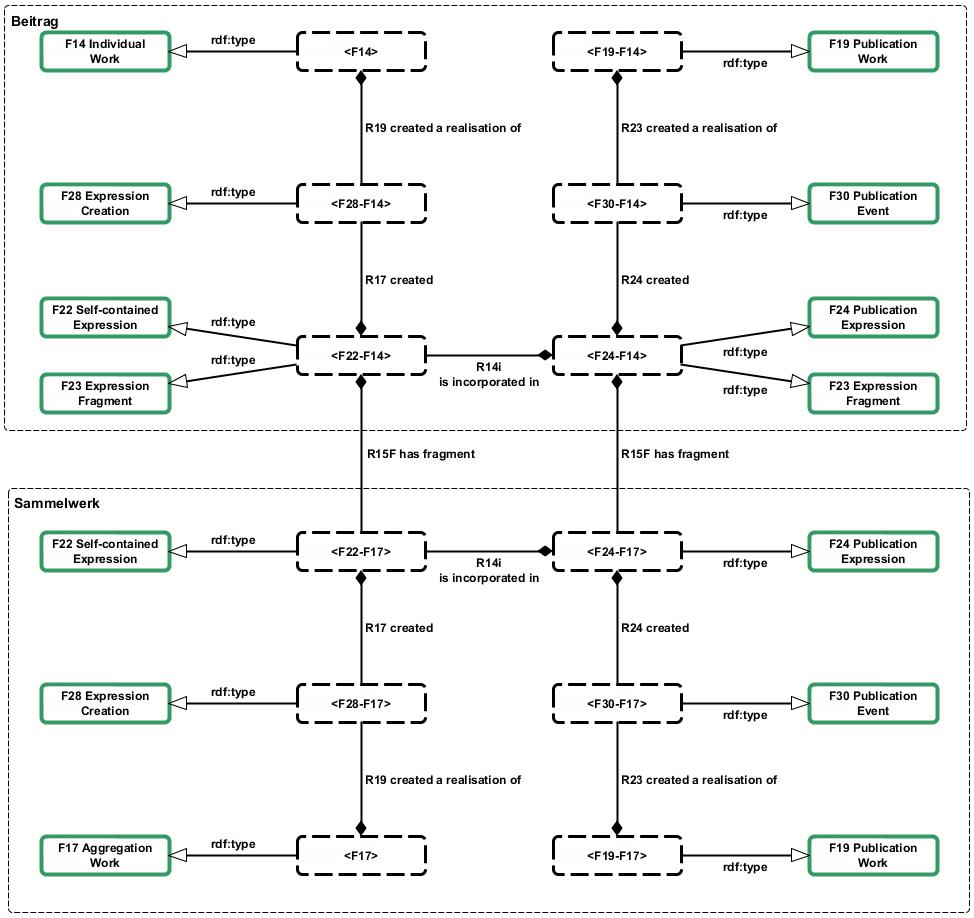
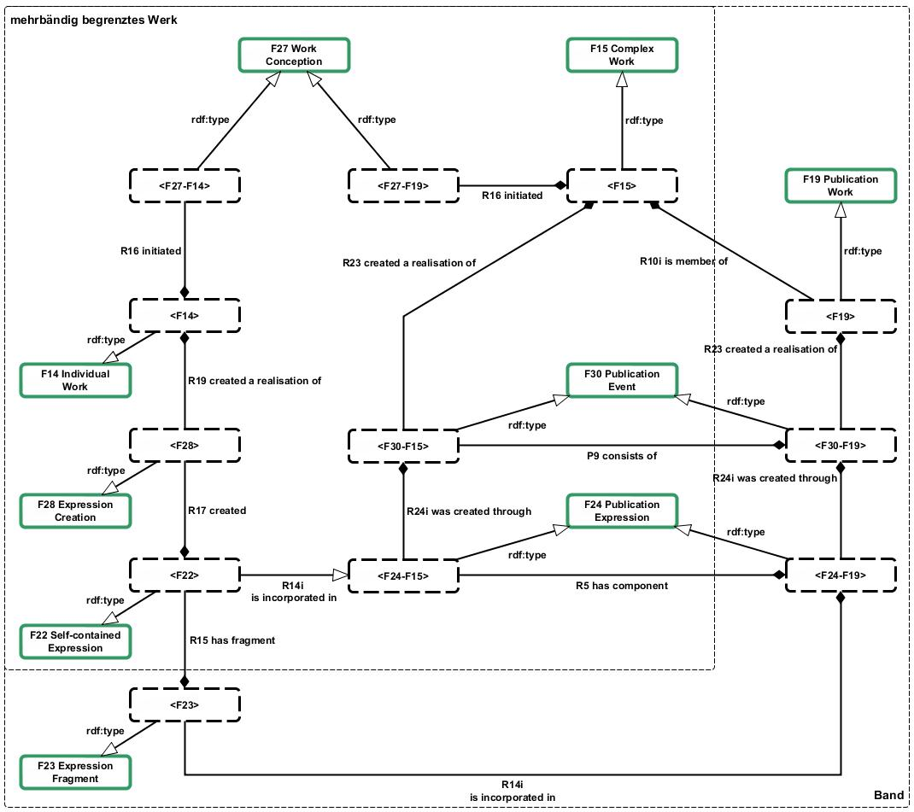
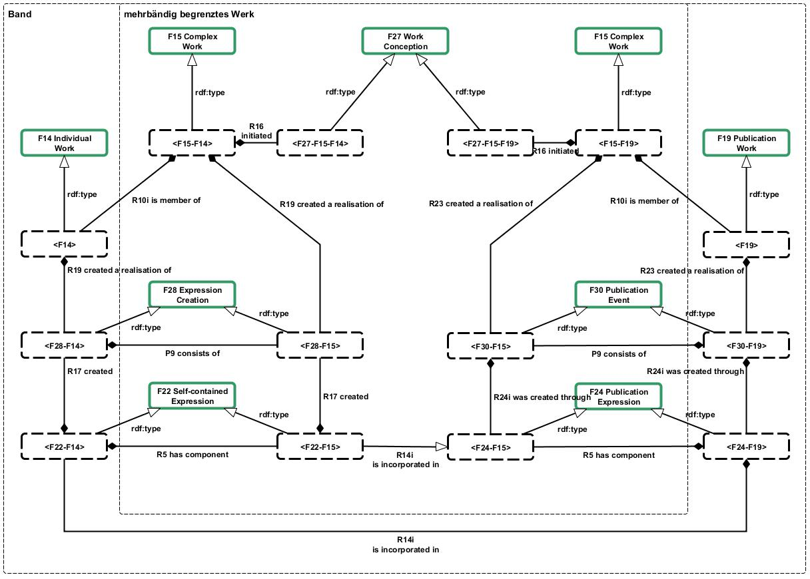

# Sammelwerke, Sammlungen, mehrbändig begrenzte Werke und FRBRoo

Veröffentlicht am 17. Februar 2013 von Hans-Georg Becker	

\
The LODLAM Mercury von Hans-Georg Becker steht unter einer Creative Commons Namensnennung 4.0 Unported Lizenz.

***

Im Beitrag [FRBRoo — Eine prozessorientierte Sicht auf bibliographische Informationen](../16/frbroo-eine-prozessorientierte-sicht-auf-bibliographische-informationen.md) habe ich gezeigt, wie sich Einzelwerke mittels FRBRoo darstellen lassen. Im folgenden wird das Modell auf Sammelwerke, Sammlungen und mehrbändig begrenzte Werke ausgeweitet.

Ein Sammelwerk oder eine Sammlung zeichnet sich dadurch aus, dass es Expressions anderer Werke in sich vereint oder anders ausgedrückt aggregiert. Für diese Werke gibt es in den FRBRoo die Entität `F17 Aggregation Work`, welches die Eigenschaften des `F14 Individual Work` und des `F16 Container Work` in sich vereint:

>    This class comprises works whose essence is the selection and/or ar-rangement of expressions of one or more other works. This does not make the contents of the aggregated expressions part of this work, but only part of the resulting expression. `F17 Aggregation Work` may include additional original parts.

An diesem Publikationstyp sind somit mehrere Werke und deren Realisierungen beteiligt: zum einen sind dies die Werke der Beiträge, zum anderen ist es das Sammelwerk an sich. Daraus folgt auch, dass es einige zu betrachtende Prozesse gibt.

Die Schöpfungsprozesse sind zunächst mal dem des Einzelwerks sehr ähnlich (bei den Beiträgen handelt es sich um Einzelwerke, beim Sammelwerk handelt es sich um ein `F17 Aggregation Work`, welches von `F14 Individual Work` abgeleitet ist). Allerdings kommt hinzu, dass die aus den Beiträgen entstandenen Expressions neben ihrer Eigenschaft sich selbst zu enthalten (`F22 Self-contained Expression`) auch Fragmente (`F23 Expression Fragment`) einer übergeordneten Expression, der des Sammelwerks, sind. Die nächste Abbildung stellt dies graphisch dar. Somit ist eine Expression/span> eines Beitrags gleichzeitig Instanz von `F22` und `F23`.

Die soeben beschriebene Fragmentierung gilt auch im Publikationsprozess. So erhält jede Expression eines Beitrags eine eigene F24 Publication Expression. Somit gilt für die Expressions im Publikationsprozess, dass sie gleichzeitig Instanzen von F24 und F23 sind.

[Beispiel](beispiel-frbroo-fur-sammelwerke-und-sammlungen-example-frbroo-for-aggregation-work.md)

**Mehrbändig begrenzte Werke**

Bei der Abbildung von mehrbändig begrenzten Werken wird es schon etwas komplexer. Es gibt hier zwei zu unterscheidende Fälle: mehrbändiges Werk im Schöpfungsprozess (bibliographische Einheiten) und mehrbändiges Werk im Publikationsprozess (buchbinderische Einheiten).
Bei der Mehrbändigkeit im Schöpfungsprozess findet die Definition der Entität `F15 Complex Work` Verwendung:

>    This class comprises works that have more than one work as members. The members of a Complex Work may constitute components of the overall concept or be alternatives to other members of the work. […] The member relationship of Work is based on the conceptual relationship, and should not be confused with the internal structural parts of an individual expression.

Die Mehrbändigkeit bezieht sich in diesem Fall auf die inhaltliche Ebene. Somit ergibt sich aus dieser Definition direkt die Unterscheidung zur Mehrbändigkeit im Publikationsprozess, bei der sich die Mehrbändigkeit rein praktisch begründet. In letzterem Fall wird die “einbändige” Expression des Verfassers in mehrere Manifestations aufgeteilt.
Die folgende Abbildung stellt ein im Publikationsprozess entstehendes mehrbändiges Werk dar, lässt dabei aber den Aspekt des Produktionsprozesses weitestgehend außen vor, da er sich nicht von dem des Kernmodells unterscheidet. Das vom Verfasser initiierte Werk wird im Vorfeld des Publikationsprozesses in mehrere Fragmente zerlegt (`F23 Expression Fragment`). Diese werden dann jeweils in den Publikationsprozess geleitet und werden somit zu Publication Works. Diese wiederum ergeben gemeinsam ein komplexes Werk im Sinne der FRBRoo-Definition, da hier eine gemeinsame inhaltliche Konzeption –- in der Regel durch den Verlag -– zugrunde liegt. Somit sind die den Werken zugrundeliegenden Instanzen der Work Conceptions unterschiedliche Ereignisse. (Im Abschnitt “Events in FRBROO: How Each Group 1 Entity Comes into Being” des Beitrags [“A Strange Model Named FRBROO. In: Cataloging & Classification Quarterly: Routledge 2012.”](https://doi.org/10.1080/01639374.2012.679222) stellt Patrick Le Boeuf dar, was genau unter der Work Conception zu verstehen ist.)

Die entstandenen Complex Works erhalten jeweils einen eigenen Expression-Zweig. Dieser existiert, sobald das Werk vollständig ist, und da es sich hier um mehrbändig begrenzte Werke handelt, ist bereits von der Vollständigkeit auszugehen. Die Expression Creation-Ereignisse der einzelnen Bände sind somit Teilereignisse der Expression Creation des `F15 Complex Work` (`P9 consists of`) und die Expressions der Bände sind Teile der Expression des Complex Work. Bei letzterem ist die Teil-Beziehung nicht mit der Enthaltenseinsbeziehung bei Wiederverwendung einer Expression zu verwechseln. In den FRBRoo heißt es zur Relation R5 has component:

>    This property associates an `F2 Expression` X with a structural compo-nent Y that conveys in itself the complete concept of a work that `is member of (R10)` the overall work realized by X. It does not cover the relationship that exists between pre-existing expressions that are re-used in a new, larger expression and that new, larger expression. Such a relationship is modeled by `R14 incorporates`.

[Beispiel für ein im Publikationsprozess mehrbändig begrenztes Werk](beispiele-frbroo-fur-mehrbaendig-begrenzte-werke-examples-frbroo-for-multivolume-works.md)

In der nächsten Abbildung ist ein im Schöpfungsprozess entstehendes mehrbändiges Werk dargestellt. Im Unterschied zum vorigen Fall findet hier die Zerlegung schon auf Werksebene statt, da der Verfasser schon bei der Konzeption einen Mehrbänder im Sinn hat. Diese Bände werden als Individual Works modelliert und durch jeweils eigene Expressions realisiert. Diese wiederum gehen dann getrennt voneinander in den Publikationsprozess. Wie auch im vorigen Fall, bilden die resultierenden Publication Works eine Einheit in Form eines Complex Work. Für den Fall, dass alle Bände von gleicher Auflage und vom gleichen Verfasser sind, so existiert auch hier eine eigene Realisierung bzw. Expression des Complex Work.

[Beispiel für ein im Schöpfungsprozess mehrbändig begrenztes Werk](beispiele-frbroo-fur-mehrbaendig-begrenzte-werke-examples-frbroo-for-multivolume-works.md)

Im nächsten Post [“FRBRoo und fortlaufende Sammelwerke”](../28/frbroo-und-fortlaufende-sammelwerke.md) werden die bisherigen Elemente zusammengefügt und somit ein Modell für die fortlaufenden Sammelwerke präsentiert.
