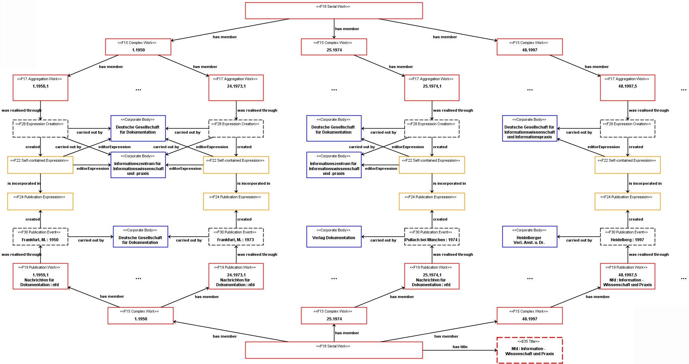
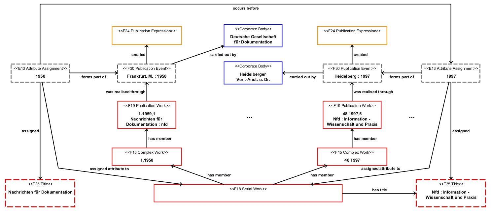

# Beispiele: FRBRoo und fortlaufende Sammelwerke

Veröffentlicht am 28. Februar 2013 von Hans-Georg Becker	

\
The LODLAM Mercury von Hans-Georg Becker steht unter einer Creative Commons Namensnennung 4.0 Unported Lizenz.

***

Beispiele für [FRBRoo und fortlaufende Sammelwerke](../28/frbroo-und-fortlaufende-sammelwerke.md)

**Nachrichten für Dokumentation in Technik und Wissenschaft, Wirtschaft und Verwaltung.** (Hauptsachtitel)

* **Nachrichten für Dokumentation : nfd** ; Zeitschrift für Informationswissenschaft und -praxis ; Mitteilungsblatt des Normenausschusses Bibliotheks- und Dokumentationswesen im DIN, Deutsches Institut für Normung e.V., des VDD – Berufsverband Information, Dokumentation, Kommunikation e.V. und der Arbeitsgemeinschaft der Spezialbibliotheken (ASpB) / hrsg. von d. Deutschen Gesellschaft für Dokumentation e.V., Frankfurt am Main / Deutsche Gesellschaft für Dokumentation, Informationszentrum für Informationswissenschaft und -praxis .\
    1.1950 – 48.1997,4. : Darmstadt : Hoppenstedt (Frankfurt, M. : Dt. Ges. für Dokumentation [1950-1973], Pullach bei München : Verl. Dokumentation [1974-1977], München [u.a.] : Saur [1978-1986], Weinheim : VCH [1987-1991]).\
    ZDB-ID: 206965-9
* **Nfd : Information – Wissenschaft und Praxis** ; Mitteilungsblatt des Normenausschusses Bibliotheks- und Dokumentationswesen im DIN, Deutsches Institut für Normung e.V. und der Arbeitsgemeinschaft der Spezialbibliotheken (ASpB) / hrsg. von der Deutschen Gesellschaft für Informationswissenschaft und Informationspraxis e.V. /\
    Deutsche Gesellschaft für Informationswissenschaft und Informationspraxis.\
    48.1997,5 – 52.2001 : Frankfurt, M. : Gesellschaft (Heidelberg : Heidelberger Verl.-Anst. u. Dr. [1997,5]).\
    ZDB-ID: 1399316-1.

Neben zahlreichen Verlagswechseln, kommen bei diesem fortlaufenden Sammelwerk mit eingebetteten mehrbändigen Werken noch einige Titeländerungen und Änderungen bei der herausgebenden Körperschaft hinzu. In der folgenden Abbildungen werden daher nur ein paar Änderungen verdeutlicht.

Zu beachten ist, dass die Änderungen sämtlichst auf der Ebene der Zeitschriftenhefte erfasst wird, da die Zeitschrift ansich (das `F18 Serial Work`) keine eigene Manifestation besitzt.\
Die Erfassung der Titeländerungen für die Zeitschrift können zusätzlich über Teilereignisse des `F30 Publication Event` des zugehörigen Heftes abgebildet werden. Diese Teilereignisse sind mittels CRM als `E13 Attribute Assignment` darstellbar und bilden den Prozess der Titelvergabe für das `F18 Serial Work` ab. Mit Hilfe von Vorgänger- und Nachfolgerrelationen der Ereignisse ist es dann möglich, dem fortlaufenden Sammelwerk den aktuellen Titel zuzuweisen (“`E13 Attribute Assignment` enthält keine Eigenschaft `P120 occours before`“).

**Mögliche RDF-Darstellung**

siehe / see: [example5.ttl](https://github.com/hagbeck/liblab/blob/master/data/examples/example5.ttl)
