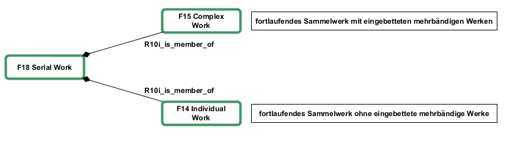

# FRBRoo und fortlaufende Sammelwerke

Posted on 28. Februar 2013 by Hans-Georg Becker	

Bei der Definition der FRBRoo wurde darauf geachtet, dass die Begrifflichkeiten der ursprünglichen Functional Requirements for Bibliographic Records noch präzisiert werden. Diese begriffliche Abklärung ergibt sich in vielen Fällen aus der Darstellung der bibliographischen Information als Prozess. Als ein Beispiel wurde in [FRBRoo — eine Anwendung](../15/frbroo-eine-anwendung.md) schon die Klasse Work mit ihren präzisierenden Unterklassen dargestellt. Insbesondere wurde mit der Klasse `F18 Serial Work` eine Möglichkeit geschaffen, die Unklarheiten zu Serials, also den fortlaufenden Sammelwerken, in den FRBR zu beseitigen. In den FRBR ist eindeutig beschrieben, dass eine Manifestation in dem Sinn abgeschlossen sein muss, dass man ein Exemplar kaufen und ins Regal stellen kann. Bei fortlaufenden Sammelwerken ist das nicht möglich, solange es weitere Bände –- beispielsweise in Form von Jahrgängen und Heften -– gibt. In FRBRoo heißt es dazu:

>    This class comprises works that are, or have been, planned to result in sequences of manifestations with common features. Whereas a work can acquire new members over the time it evolves Expressions and Manifestations are identified with a certain state achieved at a particular point in time. Therefore there is in general no single expression or manifestation representing a complete serial work, unless the serial work is ended. […] Serial Works may or may not have a plan for an overall expression.

Es ist zu beachten, dass FRBRoo keine Unterscheidung zwischen Serien und Reihen bzw. Periodika macht, da der Unterschied “nur” in der Art der Erscheinungsweise liegt und dies über andere Mechanismen modellierbar ist. Somit ergeben sich zwei Fälle: 

* fortlaufende Sammelwerke mit eingebetteten mehrbändigen Werken und
* fortlaufende Sammelwerke ohne eingebettete mehrbändige Werke

Zu Ersteren zählen beispielsweise Zeitschriften mit Jahrgangzählung.

**Fortlaufende Sammelwerke mit eingebetteten mehrbändigen Werken**

Nachdem, was in dieser Beitragsreihe bisher gezeigt wurde, lässt sich ein mehrbändiges Werk innerhalb eines fortlaufenden Sammelwerks als `F15 Complex Work` beschreiben. Dass dies auch im Falle von Periodika gilt, in dem die Jahrgänge in der Regel Fortsetzungswerke sind, wird auch durch folgendes Zitat aus der Definition zu `F15 Complex Work` deutlich: “One part may not be finished when another is already revised.”
Die Komponente des unbestimmten Endes eines fortlaufenden Sammelwerks entsteht also bei der Einbindung der Complex Works der Mehrbänder in das Serial Work. In der folgenden Abbildung wird das `F15 Complex Work` zum Publikationsprozess dann noch zusätzlich um die Struktur des `F18 Serial Work` erweitert.

**Fortlaufende Sammelwerke ohne eingebettete mehrbändige Werke**

Die letzte Abbildung zeigt auch, wie sich dieser Fall aus den vorherigen Modellen herleiten lässt. Da es sich hier um Einzelwerke und Sammelwerke handelt, die in einer Reihe erschienen sind, werden die Individual Works und somit auch die Aggregation Works als member eines Serial Work definiert.

[Beispiel für fortlaufende Sammelwerke](beispiele-frbroo-und-fortlaufende-sammelwerke.md)

**Und nun?**

In dieser Beitragsreihe habe ich gezeigt, dass man mittels FRBRoo bibliographische Daten als Linked Data darstellen kann. Ich hoffe, dass ich ebenfalls zeigen konnte, dass man vor den FRBRoo keine Angst haben muss 😉

Eines sollte man bei der Betrachtung solcher Modelle immer im Hinterkopf haben: Bibliographische Metadaten müssen nicht in dieser Form katalogisiert werden, sie werden lediglich so gespeichert!
Wir müssen uns im Bibliothekswesen von dem Gedanken verabschieden, dass wir die Datenfelder in den Formaten als MAB/MARC-Feld-Wert-Paare und deren Unterfeldern erfassen müssen, wie es in den einschlägigen integrierten Bibliothekssystemen derzeit der Fall ist.
Es sollten vielmehr Erfassungssysteme entwickelt werden, die eine semantisch reichhaltige Verknüpfung zu Daten aus der Linked Open Data Cloud zulassen und die wenigen noch übrig bleibenden Zeichenketten und Zahlen in einfachen Formularen erfassen. Die semantischen Netze der Datenmodelle, wie sie die FRBRoo darstellen, werden im Hintergrund und vom (bibliothekarischen) Nutzer verborgen angelegt.
