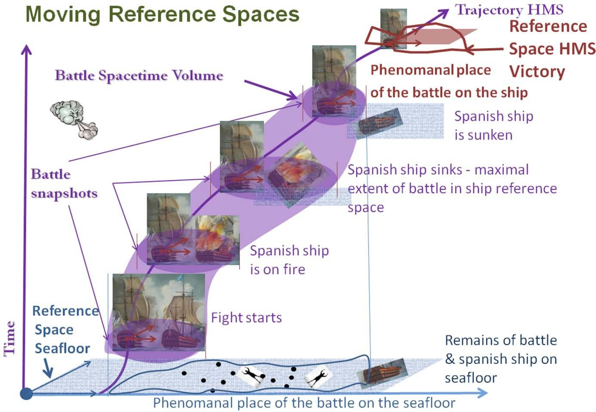

# CRMdig und CRMgeo — zwei Erweiterungen für das CIDOC CRM

Veröffentlicht am 22. Oktober 2013 von Hans-Georg Becker	

\
The LODLAM Mercury von Hans-Georg Becker steht unter einer Creative Commons Namensnennung 4.0 Unported Lizenz.

***

Über die Rolle und Mächtigkeit des CIDOC CRM für die Beschreibung von Zusammenhängen im Bereich des kulturellen Erbes habe ich u.a. im Beitrag [FRBRoo — eine Anwendung](../../02/15/frbroo-eine-anwendung.md) geschrieben und gezeigt, dass auch bibliographische Zusammenhänge mittels der Erweiterung FRBRoo sehr gut darstellbar sind.
Doch es gibt auch noch offene bzw. nur unzureichend modellierte Fragestellungen. Zum einen ist die Ausgestaltung des Bereichs der Geoinformationen überraschend überschaubar. Zum anderen ist auch die wichtige Frage der Provenienz im Hauptmodell nicht weit genug gefasst.
Um die beiden Lücken zu schließen, wurden [CRMdig](http://www.cidoc-crm.org/docs/CRMdig-TAPP11.pdf) (“A generic digital provenance model for scientific observation”) und [CRMgeo](http://www.cidoc-crm.org/docs/Technical%20Report435-CRMgeo.pdf) (“A spatio-temporal refinement of the CIDOC CRM Model”) als Erweiterungen für das CRM entwickelt.

## Informationen zur Provenienz im CRM

Wie seinerzeit auch im [DFG-Projekt “ArcheoInf”](https://data.ub.tu-dortmund.de/archeoinf/) gesehen, macht eine Veröffentlichung von Forschungsdaten keinen Sinn, wenn diese nicht verstanden werden können. Um die Daten verstehen zu können sind Informationen zur inhaltlichen Bedeutung und zu den Umständen der Entstehung der Daten notwendig, also Angaben zur Provenienz. Die [W3C Provenance Incubator Group](http://www.w3.org/2005/Incubator/prov/wiki) schreibt dazu: 

> Provenance of a resource is a record that describes entities and processes involved in producing and delivering or otherwise influencing that resource.

Was beduetet das nun im im Einzelnen? Welche Informationen müssen erfasst werden?
In ihrem auf der [TaPP-Konferenz 2011](https://www.usenix.org/legacy/events/tapp11/) vorgestellten Papier “CRMdig: A generic digital provenance model for scientific observation” beschreiben Doerr und Theodoridou fünf zu beantwortende Frage:

*    WER: Personen und Insitutionen, die bei der Entstehung der Daten beteiligt waren
*    WO: Orte, an denen die Daten entstanden sind
*    WANN: zeitliche Angaben zur Entstehung der Daten
*    WAS: Dinge, die in dem Prozess eine Rolle spielen
*    WIE: Beschreibung des Prozesses und der eventuell verwendeten Technik

Das folgende Bild zeigt das Netz von Objekten und Prozessen für zwei Digitaliserungsereignisse und die darauf folgenden Verarbeitungsschritte. Bei der Digitaliserung wurden zwei verschiedene Techniken verwendet, die letztlich zwei 3D Modelle des Objektes erzeugen.

Das CRMdig stellt bei der Beschreibung die Entität Digital Machine Event in den Mittelpunkt und geht davon aus, dass jedes dieser Ereignisse durch eine menschliche Person angestoßen wird. Das folgende Diagramm zeigt die Modellierung in der üblichen CRM-Manier, wobei hier die Entitäten mit einem vorangestellten D und die Eigenschaften mit einem vorangestellten L bezeichnet werden.

Für die Anwendung im Kontext von Linked Data wird auch eine [RDFS-Version](http://www.ics.forth.gr/isl/rdfs/3D-COFORM_CRMdig.rdfs) angeboten.

# Geoinformationen im CRM

Die wachsenden Möglichkeiten des (Mobile) Webs wecken auch die Bedürfnisse nach Anreicherungen von Informationen des kulturellen Erbes, um präzise und gut identifizerbare Beschreibungen von Örtlichkeiten, Landschaften oder historischen Ereignissen oder Überbleibseln anzubeiten. Für die Beschreibung solcher Gegebenheiten gibt es auf der einen Seite die Geoinformationssysteme (GIS), die eher geschlossene Systeme darstellen und für die Vermessung und Repräsentation von kulturhistorischen und archäologischen Erscheinungen aber auch für Anwendungen anderer Geowissenschaften verwendet werden. Auf der anderen Seite sind Archive, Bibliotheken und Museen bemüht, detailierte Metadaten über physikalische und konzeptionelle Objekte zu erfassen, wobei Sie zwar stark auf Typologien, individuelle Objekte, Personen und Ereignisse sowie präzisen Datums- und Zeitraumangaben achten, aber wenig reichhaltige Ortsangaben verwenden.
Diese Praxis stößt sehr schnell an ihre Grenzen, wenn nun versucht wird, die Beschreibungen aus den Archiven, Bibliotheken und Musseen mit Stadtplänen o.ä. zu verbinden. Aussagen wie “Die Leute wissen schon wo Parthenon liegt.” oder “Du wirst es sehen, wenn Du in Athen bist.” sind im Bereich der Informationssysteme nicht wirklich hilfreich.
Beide Bereiche verfügen aber bereits über etablierte Standards zur Beschreibung von solchen Sachverhalten: im Bereich der Geowissenschaften ist dies der OGC/ISO Standard und im Bereich Archive, Bibliotheken und Museen ist es der ISO-Standard CIDOC CRM. Allerdings unterscheiden sich dabei die Sichtweisen und lassen sich zudem auch nicht so richtig in Einklang bringen.

Diese Erkenntnis hat man beim [ICS-FORTH ](http://www.ics.forth.gr/)(Institute of Comupter Science, Foundation for Research and Technology, Griechenland) dazu genutzt, um diese Lücke zu schließen. Herausgekommen ist mit CRMgeo eine Erweiterung des CIDOC CRM. Die Idee dabei ist, dass Fragen wie “Ist das der Ort, an der die Varus Schlacht stattgefunden hat?” oder “Ist das der Ort, an dem Lord Nelson starb?” auf ihren Wahrheitsgehalt überprüft werden können. Es wird schnell klar, dass – wie im Beispiel der Varusschlacht – auch ungenaue Informationen bzw. – wie im Fall Lord Nelson – auch verschiedene Sichten auf einen Ortskontext berücksichtigt werden müssen.

Der [Report zu CRMgeo](http://www.cidoc-crm.org/docs/Technical%20Report435-CRMgeo.pdf) zeigt an den beiden genannten Beispielen die Zusammenhänge und die Mächtigkeit des Modells und erweitert das CRM so um eine weitere wichtige Komponente.
