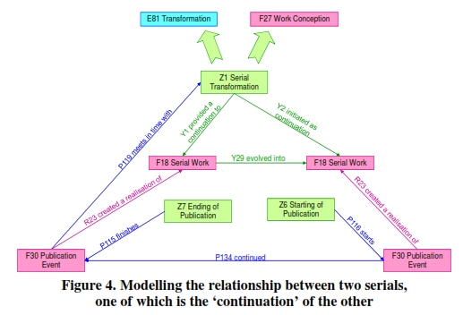
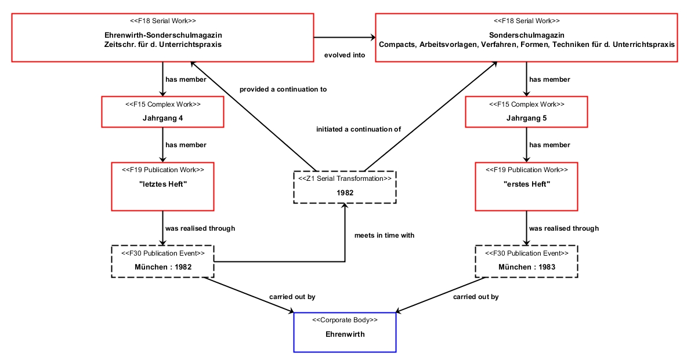
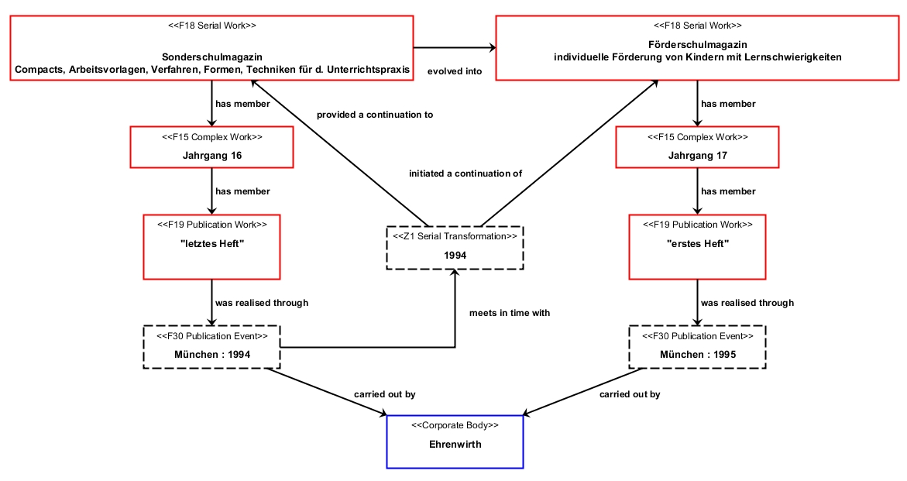

# PRESSoo und ECPO – Zwei weitere Ontologien zur Beschreibung von fortlaufenden Sammelwerken

Posted on 8. November 2013 by Hans-Georg Becker	

Die Modellierung von fortlaufenden Sammelwerken mittels des Referenzmodells FRBR gestaltet sich schwierig. Als Gründe seien vor allem die Unvollständigkeit von fortlaufenden Sammelwerken und die Heterogenität der in fortlaufenden Sammelwerken enthaltenen Manifestationen genannt.

## Unvollständigkeit von fortlaufenden Sammelwerken

In den FRBR ist festgelegt, dass eine Manifestation in dem Sinn abgeschlossen sein muss, dass man ein Exemplar kaufen und ins Regal stellen kann. Bei fortlaufenden Sammelwerken ist das nicht möglich, solange es weitere Hefte und Jahrgänge im Fall von Zeitschriften oder Bände im Fall von Reihen oder Serien gibt.

## Heterogenität der in fortlaufenden Sammelwerken enthaltenen Manifestationen

Teile einer Buchreihe können in einer weiteren Auflage in einer anderen Reihe oder selbständig veröffentlicht werden; Zeitschriftenhefte können als Themenhefte wiederum als Buch veröffentlicht werden.

Denkt man die Werke eher vom Inhalt und weniger von der physikalischen Erscheinungsform, so lassen sich diese Probleme in der bibliographischen Beschreibung umgehen. Mittels FRBRoo ist genau dieser Ansatz möglich (siehe z.B. in [FRBRoo — eine Anwendung](../../02/15/frbroo-eine-anwendung.md) oder [FRBR, Serials und CIDOC CRM](https://doi.org/10.1515/9783110278736.64)).

Fortlaufende Sammelwerke und insbesondere Zeitschriften sind allerdings noch wesentlich komplexer in der bibliographischen Beschreibung, da auch historische Zusammenhänge erfasst werden müssen. Zwar lassen sich diese Informationen auch mit FRBRoo modellieren, jedoch nur sehr abstrakt und umständlich.

## PRESSoo

Im März 2013 ist nahezu unbemerkt eine erste Version einer Erweiterung der FRBRoo für fortlaufende Sammelwerke erschienen. Die Erweiterung nennt sich PRESSoo ([Version 0.1](https://www.issn.org/files/issn/technicals/PRESSoo_01.pdf)) und betrachtet neben einer groben Darstellung der Zusammenhänge der bibliographischen Einheiten insbesondere die Veränderungen im Laufe des Lebens eines solchen Werkes.

Dadurch lassen sich folgende Transformationen modellieren:

*    Fortsetzungen (z.B. Titeländerungen)
*    Ersetzungen (Fortsetzung mit neuer Erscheinungsweise)
*    Aufgehen eines fortlaufendes Sammelwerks in ein anderes
*    Abspalten eines Teils zu einem neuen fortlaufenden Sammelwerk
*    Zusammenführen von mehreren fortlaufenden Sammelwerken
*    Aufteilen eines fortlaufendes Sammelwerks in mehrere Neue

Zusätzlich lassen sich auch temporäre Veränderungen modellieren.

Für Fortsetzungen wird der Prozesss in PRESSoo mittels einer neuen Ereignis-Entität `Z1 Serial Transformation` modelliert. Diese Ereignisse stehen in natürlicher Beziehung zu den letzten `F30 Publication Events` des Vorgängerwerkes bzw. zu den ersten `F30 Publication Events` des Nachfolgewerkes. Dabei werden diese `F30 Publication Events` mittels `Z6 Starting of Publication` und `Z7 Ending of Publication` präzisiert.



Beispiel 1:\
[Förderschulmagazin : individuelle Förderung von Kindern mit Lernschwierigkeiten](https://ld.zdb-services.de/resource/1217829-9)\
früher: [Sonderschulmagazin : Compacts, Arbeitsvorlagen, Verfahren, Formen, Techniken für d. Unterrichtspraxis](https://ld.zdb-services.de/resource/798053-x)
früher: E[hrenwirth-Sonderschulmagazin : Zeitschr. für d. Unterrichtspraxis](https://ld.zdb-services.de/resource/800272-1)





```
<http://ld.zdb-services.de/resource/800272-1> [
  a frbroo:F18_Serial_Work ;
  rdaGr1:preferredTitleForTheWork "Ehrenwirth-Sonderschulmagazin : Zeitschr. für d. Unterrichtspraxis" ;
  pressoo:Y1i_was_continued_through [
    a pressoo:Z1_Serial_Transformation ;
	pressoo:Y2_initiated_as_continuation <http://ld.zdb-services.de/resource/798053-x> ;
  ] ;
  pressoo:Y29_evolved_to <http://ld.zdb-services.de/resource/798053-x> ;
] .

<http://ld.zdb-services.de/resource/798053-x> [
  a frbroo:F18_Serial_Work;
  rdaGr1:preferredTitleForTheWork "Sonderschulmagazin : Compacts, Arbeitsvorlagen, Verfahren, Formen, Techniken für d. Unterrichtspraxis" ;
  pressoo:Y1i_was_continued_through [
    a pressoo:Z1_Serial_Transformation ;
	pressoo:Y2_initiated_as_continuation <http://ld.zdb-services.de/resource/1217829-9> ;
  ] ;
  pressoo:Y29_evolved_to <http://ld.zdb-services.de/resource/1217829-9> ;
] .

<http://ld.zdb-services.de/resource/1217829-9> [
  a frbroo:F18_Serial_Work;
  rdaGr1:preferredTitleForTheWork "Förderschulmagazin : individuelle Förderung von Kindern mit Lernschwierigkeiten" ;
] .
```

PRESSoo ermöglicht neben den diversen Transformationen auch die Modellierung von Faksimiles, Digitalisierungen (Hier kommt auch die CIDOC CRM-Erweiterung CRMdig zum Einsatz.) und sogar kumulierten Fassungen. Die Modellierung von Kumulationen kann bespielsweise für die Bindeeinheiten in Bibliotheksbeständen herangezogen werden. Dabei wird dann das zugehörige `F30 Publication Event` durch die Buchbinderei durchgeführt.

## Beschreibung der Entität `Z12 Issuing rule`

Im deutschen Bibliothekswesen entwickeln sich derzeit einige Mikroontologien rund um die Darstellung von Bibliotheksservices und bibliographischen Metadaten im Linked Data Kontext. Als Beispiele seien hier [DAIA](https://gbv.github.io/daiaspec/daia.html), [PAIA](https://gbv.github.io/paia/paia.html), [DSO](https://gbv.github.io/dso/dso.html), [SSSO](https://gbv.github.io/ssso/ssso.html), [MWO](https://github.com/dini-ag-kim/movingwall/blob/master/mwo.md) und [ECPO](https://cklee.github.io/ecpo/ecpo.html) genannt. Letztere stellt eine Ontologie zur Beschreibung von Erscheinungsweisen und Bestandsverläufen bei fortlaufenden Sammelwerken dar. (Die Ontologie geht davon aus, dass auch von Zeitschriften Exemplare exisitieren (“An Agent always holds a copy of a document called item.”)). Im Sinne der FRBR ist das allerdings so nicht korrekt und gilt nur in dem Fall, dass ein fortlaufendes Sammelwerk sein Erscheinen eingestellt hat. Mit PRESSoo wurde daher eine Entität `Z9 Storage Unit` eingeführt, die die Bestände von z.B. Bibliotheken beschreibt. ECPO ist allerdings so definiert (es wird keine Aussage zur Domain bei den zentralen Relationen gemacht), dass die Konzepte auch für `F18 Serial Work` anwendbar sind.)) Somit lassen sich also Entitäten `Z12 Issuing Rule` aus PRESSoo mit Hilfe von ECPO beschreiben.

Beispiel 2: [CCQ – Cataloging & classification quarterly](https://ld.zdb-services.de/resource/801602-1)\
Erscheinungsverlauf nach ZDB: 1.1980/82; 2.1982; 3.1982/83 –

```
<http://ld.zdb-services.de/resource/801602-1> [
  a frbroo:F18_Serial_Work;
  rdaGr1:preferredTitleForTheWork "Cataloging & classification quarterly" ;
  pressoo:Y38_has_current_issuing_rule [
    a ecpo:CurrentChronology, pressoo:Z12_Issuing_Rule ;
    dct:hasPart [
      a ecpo:Chronology, pressoo:Z12_Issuing_Rule ;
      ecpo:hasItemizedVolumeNumbering "1" ;
      ecpo:hasItemizedTemporal "1980/82" ;
    ];
    dct:hasPart [
      a ecpo:Chronology, pressoo:Z12_Issuing_Rule ;
      ecpo:hasItemizedVolumeNumbering "2" ;
      ecpo:hasItemizeTemporal "1982" ;
    ];
    dct:hasPart [
      a ecpo:CurrentChronology, pressoo:Z12_Issuing_Rule ;
      ecpo:hasBeginVolumeNumbering "3" ;
      ecpo:hasBeginTemporal "1982/83" ;
    ];
  ];
] .
```

## Fazit

Mit den beiden hier beschriebenen Ontologien ließe sich die deutsche Zeitschriftendatenbank (ZDB) CIDOC CRM-kompatibel als Linked Data veröffentlichen und würde so eine integrierte Verwendung im gesamten Bereich des kulturellen Erbes ermöglichen.
