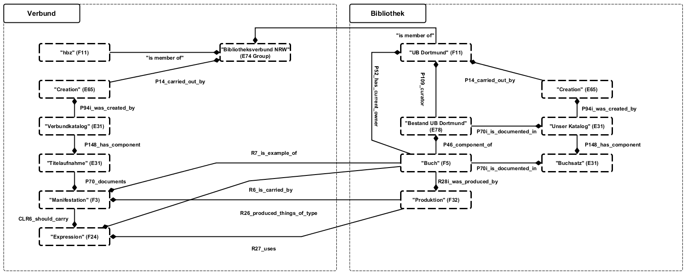
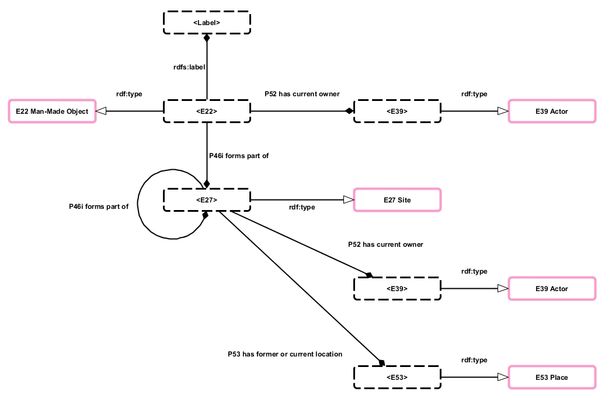
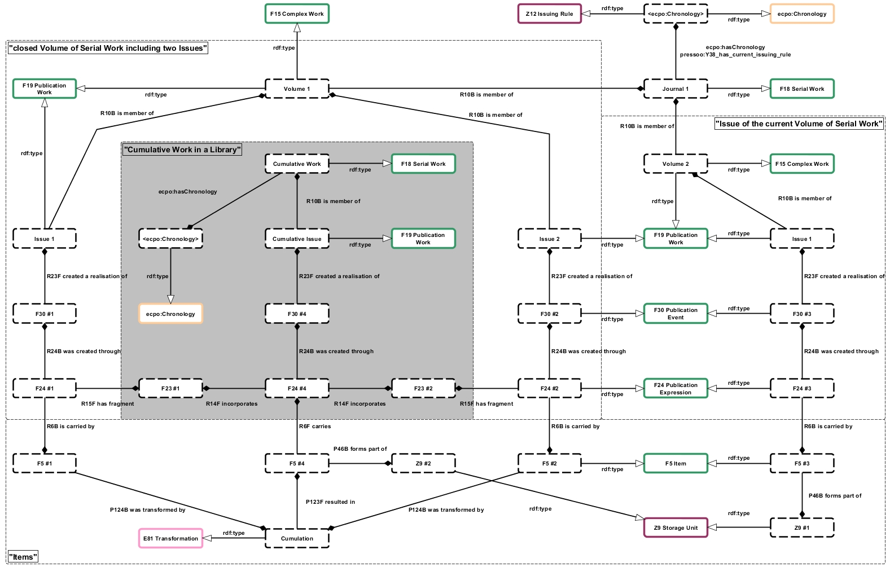
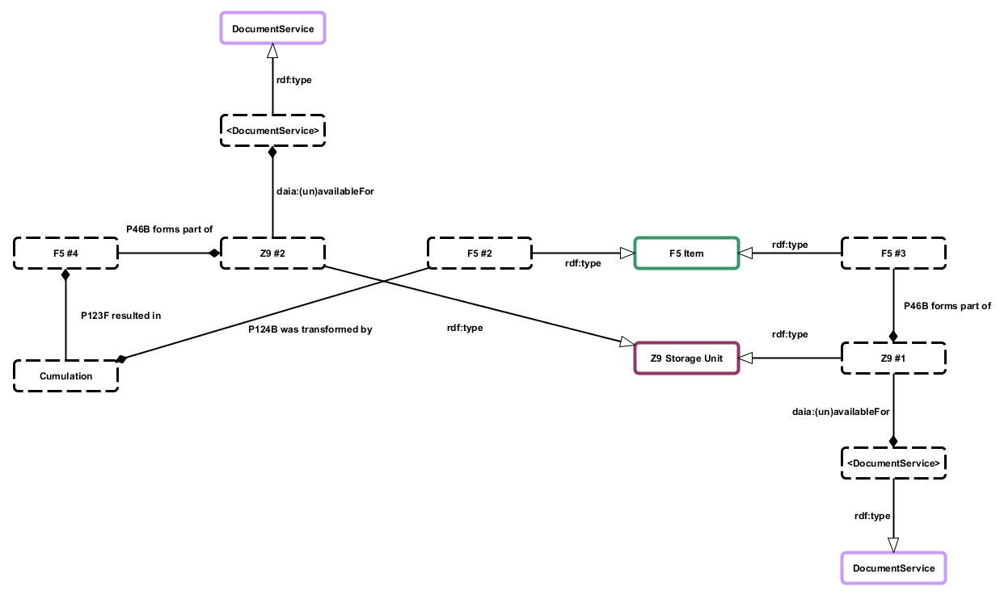

# Bestandsnachweise von Bibliotheken als Linked Data

Veröffentlicht am 22. November 2013 von Hans-Georg Becker	

\
The LODLAM Mercury von Hans-Georg Becker steht unter einer Creative Commons Namensnennung 4.0 Unported Lizenz.

[English Version](./library-holdings-as-linked-data.md)

***

Lukas Koster formulierte in seinem Blog-Beitrag [“Local library data in the new global framework”](https://commonplace.net/2012/01/local-library-data-in-the-new-global-framework/) sehr treffend:

>    It doesn’t really make sense if all libraries in the world publish identical metadata side by side, does it?\
>    In essence only really unique data is worth publishing. You link to the rest.

Unter den wenigen Beispielen, in denen typische Bibliotheken unikale (Meta-)Daten als Linked Open Data veröffentlichen können, sind spezielle
Sammlungen und auch die immer wichtiger werdenden Forschungsinformationen wissenschaftlicher Einrichtungen. Eine wichtige Datenmenge, die alle Bibliotheken gemeinsam haben, ist aber tatsächlich die der Bestandsnachweise.
In Zeiten, in denen bibliographische Informationen direkt von den Verlagen in die Suchmaschinen des WWW wandern, sind die Bestandsnachweise als Quelle für vernetzte und insbesondere auch mobile Anwendungen interessantes Material.
So wundert es nicht, dass es mittlerweile mehrere Ansätze für die Beschreibung der Bestände gibt. Genannt seien hier:

*    [Holdings Ontology](https://dini-ag-kim.github.io/holding-ontology/holding.html) im Rahmen der DINI-KIM-AG (s. [Wiki der DINI-KIM-AG](https://wiki.dnb.de/pages/viewpage.action?pageId=43523047))
*    [Library Holdings RDF Vocabulary](https://homepages.inf.ed.ac.uk/v1wwaite/2011/06/holdings.html) / EDINA (EDINA is the [Jisc](https://www.jisc.ac.uk/)-designated national data centre at the [University of Edinburgh](https://www.ed.ac.uk/). ))
*    [Holdings via Offer](https://www.w3.org/community/schemabibex/wiki/Holdings_via_Offer) im Rahmen der [Schema Bib Extend Community Group](https://www.w3.org/community/schemabibex/wiki/Main_Page)

Betrachtet man u.a. die bisherigen Beiträge dieses Blogs, so wurde die Flexibilität und Aussagekraft von CRM, FRBRoo und PRESSoo bereits bewiesen. Diese Beiträge haben sich bisher weitestgehend auf die Beschreibung von bibliographischen Objekten und Konzepten bezogen, wobei der Bereich des Bestandsnachweises nur kurz angerissen wurde.

Aber auch mit den Ontologien des CRM-Universums in Verbindung mit den Konzepten rund um [DAIA](https://gbv.github.io/daiaspec/daia.html) können die Bestandsnachweise sehr gut beschrieben werden.

## WEM + I im CIDOC CRM-Universum

Am Beispiel des Katalogs der UB Dortmund und des “hbz-Verbundkatalogs”[^1]. soll zunächst gezeigt werden, wie eine zentrale Stelle identische Metadaten verschiedener Quellen — hier also konkret die Bereiche Work, Expression, Manifestation (WEM) — als Linked Data publizieren kann und die unikalen Metadaten der Items (I) durch die Lokalsysteme publiziert werden können.
Das folgende Diagramm stellt die Verlinkung der beiden Metabereiche dar. Dabei beschränkt es sich auf die wesentlichen Komponenten und setzt die Modelle aus [FRBRoo — eine Anwendung](../../02/15/frbroo-eine-anwendung.md) voraus.

[^1]: Der Katalog des Bibliotheksverbunds NRW wird vom
Hochschulbibliothekszentrum NRW (hbz) betrieben und entsteht durch eine gemeinsame Katalogisierung der Verbundbibliotheken in ein zentrales
Bibliothekssystem (ILS). Die in diesem System erfassten Daten werden anschließend in den Lokalsystemen repliziert.

[](Verbund-Lokal-System.jpg)

Das obige Diagramm zeigt auf der Seite der tatsächlichen Bestände nur das Konzept der `F5 Item` aus FRBRoo. Mit dem Erscheinen von PRESSoo gibt es auch für die Bestände von Zeitschriften ein geeignetes “Item”, nämlich `Z9 Storage Unit`. Auch für digitale Objekte gibt es mit der CRM-Erweiterung CRMdig eine geeignete Darstellung auf Exemplarebene.

## Bestandsnachweise

Um nun die Bestandsnachweise mit dem CRM zu beschreiben, macht man sich die Eigenschaften der Eltern-Entitäten der Exemplar-Entitäten zu nutze. Es gilt:

*    `F5 Item` `subClassOf` `E84 Information Carrier` `subClassOf` `E22 Man-Made Object`
*    `Z9 Storage Unit` `subClassOf` `E22 Man-Made Object`
*    `D13 Digital Information Carrier` `subClassOf` `E84 Information Carrier` `subClassOf` `E22 Man-Made Object`
*    `E22 Man-Made Object` `subClassOf` `E19 Physical Object` `subClassOf` `E18 Physical Thing`

Üblicherweise werden solche physischen Dinge an bestimtmen Orten aufbewahrt und gegebenenfalls zugänglich gemacht. Die Aufbewahrungsorte können mit dem CRM-Konzept `E27 Site` beschrieben werden. Im CRM heißt es dazu:

>    In contrast to the purely geometric notion of `E53 Place`, this class describes constellations of
>  matter on the surface of the Earth or other celestial body, which can be represented by
>    photographs, paintings and maps.

Somit können Aufbewahrungsorte wie Zweigstellen, Sektionen, Abteilungen oder Magazine über `E27 Site` Aussagen über Zusammenhänge und Eigentumsverhältnissen zugeordnet werden. Dazu werden folgende Relationen des CRM verwendet (`E27 Site` `subClassOf` `E18 Physical Thing`):

*    `E18 Physical Thing` `P46 is composed of (forms part of)` `E18 Physical Thing`
*    `E18 Physical Thing` `P52 has current owner (is current owner of)` `E39 Actor`
*    `E18 Physical Thing` `P58 has section definition (defines section)` `E46 Section Definition`

[](Bestandsnachweis1.jpg)

**Beispiel 1:** The FRBR family of conceptual models

```
<http://data.ub.tu-dortmund.de/resource/item/20129967> [
  a frbroo:F5_Item ;
  rdfs:label "A 12726" ;
  ecrm:P52_has_current_owner <http://lobid.org/organisation/DE-290> ;				
  ecrm:P46i_forms_part_of [
	a ecrm:E27_Site ;
	ecrm:P58_has_section_definition [
		a ecrm:E46_Section_Definition ;
		rdfs:label "Second Floor"
	]  ;
	ecrm:P46i_forms_part_of [
		a ecrm:E27_Site ;
		ecrm:P58_has_section_definition [
			a ecrm:E46_Section_Definition ;
			rdfs:label "Central Library"
		] ;
		ecrm:P46i_forms_part_of [
		  a ecrm:E27_Site ;
		  ecrm:P58_has_section_definition [
			a ecrm:E46_Section_Definition ;
			rdfs:label "TU Dortmund, University Library"
		  ] ;
		] ;
	] ;
  ] ;  
] .
```

Das RDF beschreibt das Exemplar mit der Signatur “A 12726”, welches sich in der Zentralbibliothek der Universitätsbibliothek der TU Dortmund im zweiten Obergeschoß befindet. Die Beschreibung der Zentralbibliothek könnte beispielsweise noch um “Geoinformationen” ergänzt werden, da es sich um einen von acht Standorten der gesamten Universitätsbibliothek handelt. Diese “Geoinformationen” sind dann ein mit `P53 has former or current location` verknüpfter `E53 Place`.

Bei fortlaufenden Sammelwerken (`F18 Serial Work`) bzw. beim Spezialfall der Zeitschriften muss man zunächst die Praxis der Aufbewahrung betrachten. Die Exemplare von Zeitschriftenheften liegen — abgesehen von den aktuellsten Heften – meist als Reihe neu gebundener Einheiten vor. Diese Reihen sind in der Regel nicht näher spezifiziert, besitzen allerdings eine gemeinsame Signatur.[^2]\
Das nachstehende Diagramm zeigt, neben einem aktuellen Heft in Originalbindung, insbesondere das Ergebnis des Bindeprozesses und den Zusammenhang zur `Z9 Storage Unit`.\
Durch die Transformation der Exemplare zu einem neuen Objekt, wird letzteres zu einem Exemplar eines neuen kumulativen Publication Work. Dieses Publication Work ist dabei ein Teil eines neuen fortlaufenden Sammelwerks in Form einer Reihe.

[^2]: Bei “einfachen” Reihen oder Serien handelt es sich bei den Bänden in der Regel um Objekte in “klassischer Buchform”, die nicht in regelmäßigen Abständen zu neuen Einheiten gebunden werden. Sie werden daher aus dieser Betrachtung herausgelassen.

[](Items_of_Serial_Works.jpg)

Der Beschreibung der Bestände verteilt sich jetzt auf zwei Objekte:

*    Die `Z9 Storage Unit` wird ähnlich wie das `F5 Item` in Beispiel 1 beschrieben.
*    Die Bestands-Chronologie wird mittels ECPO dem neu entstandenen `F18 Serial Work` zugeordnet.[^3]
    
[^3]: vgl. auch [“PRESSoo und ECPO – Zwei weitere Ontologien zur Beschreibung von fortlaufenden Sammelwerken”](../08/pressoo-und-ecpo-zwei-weitere-ontologien-zur-beschreibung-von-fortlaufenden-sammelwerken.md)

Im folgenden Beispiel wird der Bestandsnachweis einer Zeitschrift anhand eines Teils ihrer `Z9 Storage Unit` gezeigt, wobei die Chronology nicht mit aufgeführt wird.

**Beispiel 2:** Bibliotheksdienst\
Diese Zeitschrift hat nach obigem Modell zwei `Z9 Storage Unit`, da Sie in zwei Standorten der Universitätsbibliothek Dortmund angeschafft wurde.

```
<http://data.ub.tu-dortmund.de/resource/storageunit/ZA_377> [
  a pressoo:Z9_Storage_Unit ;
  rdfs:label "ZA 377" ;
  ecrm:P52_has_current_owner <http://lobid.org/organisation/DE-290> ;	
  ecrm:P46I_forms_part_of [
	a ecrm:E27_Site ;
	ecrm:P58_has_section_definition [
		a ecrm:E46_Section_Definition ;
		rdfs:label "Basement Level 1"
	]  ;
	ecrm:P46I_forms_part_of [
		a ecrm:E27_Site ;
		ecrm:P58_has_section_definition [
			a ecrm:E46_Section_Definition ;
			rdfs:label "Central Library"
		] ;
		ecrm:P46I_forms_part_of [
		  a ecrm:E27_Site ;
		  ecrm:P58_has_section_definition [
			a ecrm:E46_Section_Definition ;
			rdfs:label "TU Dortmund, University Library"
		  ] ;
		] ;
	] ;
  ] ;  
] . 
```
```
<http://data.ub.tu-dortmund.de/resource/storageunit/Bibliotheksdienst> [
  a pressoo:Z9_Storage_Unit ;
  rdfs:label "Bibliotheksdienst" ;
  ecrm:P52_has_current_owner <http://lobid.org/organisation/DE-290> ;				
  ecrm:P46I_forms_part_of [
	a ecrm:E27_Site ;
	ecrm:P58_has_section_definition [
		a ecrm:E46_Section_Definition ;
		rdfs:label "R. 501"
	]  ;
	ecrm:P46I_forms_part_of [
		a ecrm:E27_Site ;
		ecrm:P58_has_section_definition [
			a ecrm:E46_Section_Definition ;
			rdfs:label "Bibl. Sozialforschungsstelle"
		] ;
		ecrm:P46I_forms_part_of [
		  a ecrm:E27_Site ;
		  ecrm:P58_has_section_definition [
			a ecrm:E46_Section_Definition ;
			rdfs:label "TU Dortmund, University Library"
		  ] ;
		] ;
	] ;
  ] ;  
] .
```

## Services für die Exemplare

Bestandsnachweise sind eigentlich ohne die Angabe damit verbundener Dienste der Einrichtung in der Linked Open Data Cloud nicht viel wert. Erst durch die mit den Exemplaren verbundenen Services, wie beispielsweise der Ausleihmöglichkeit, werden Mehrwerte angeboten, die durch die bibliographische Beschreibung allein nicht darstellbar sind.

Wie schon im vorigen Beitrag bemerkt, entwickeln sich aktuell im deutschen Bibliothekswesen einige Mikroontologien rund um die Darstellung von Bibliotheksservices und bibliographischen Metadaten im Linked Data Kontext. Um die mit den tatsächlichen Beständen verbundenen Services und Status zu beschreiben, können die in diesem Rahmen entwickelten Ontologien [DAIA](https://gbv.github.io/daiaspec/daia.html), [DSO](https://gbv.github.io/dso/dso.html) und [SSSO](https://gbv.github.io/ssso/ssso.html) verwendet werden.

Das folgende Diagramm zeigt die Anbindung der Document Service Ontology an die `Z9 Storage Unit` mittels DAIA. Hierbei wird vorausgesetzt, dass der Document-Begriff in DSO und in DAIA auch `Z9 Storage Unit` berücksichtigt.[^4] 

[^4]: In der Spezifikation zu DSO heißt es: “The set of documents is not limited to a specific class[…]”. Daher ist hier die Annahme berechtigt. Bei DAIA müsste die Spezifikation dahingehend erweitert werden, da hier nur frbr:items verwendet werden.

[](Z9-DAIA.jpg)

Die zugeordneten Document Services werden mit der Simple Service Status Ontology beschreiben. Somit sind dann Aussagen wie “Das Exemplar A ist bis zum Datum X nicht ausleihbar.” möglich.

**Beispiel 3:** ausleihbares Exemplar mittels daia:availableFor

```
<http://data.ub.tu-dortmund.de/resource/item/20129967> [
  a frbroo:F5_Item ;
  rdfs:label "A 12726" ;
  daia:availableFor [
    a dso:Loan ;
  ] ;
  ecrm:P52_has_current_owner <http://lobid.org/organisation/DE-290> ;				
  ecrm:P46I_forms_part_of [
	a ecrm:E27_Site ;
	ecrm:P58_has_section_definition [
		a ecrm:E46_Section_Definition ;
		rdfs:label "Second Floor"
	]  ;
        ...
  ] ;  
] .
```

**Beispiel 4:** Zeitschriftenbestand für die Präsenznutzung und Fernleihe

```
<http://data.ub.tu-dortmund.de/resource/storageunit/ZA_377> [
  a pressoo:Z9_Storage_Unit ;
  rdfs:label "ZA 377" ;
  daia:unavailableFor [
    a dso:Loan ;
  ] ;
  daia:availableFor [
    a dso:Presenation ;
  ] ;
  daia:availableFor [
    a dso:Interloan;
  ] ;
  ecrm:P52_has_current_owner <http://lobid.org/organisation/DE-290> ;	
  ecrm:P46I_forms_part_of [
	a ecrm:E27_Site ;
	ecrm:P58_has_section_definition [
		a ecrm:E46_Section_Definition ;
		rdfs:label "Basement Level 1"
	]  ;
        ...
  ] ;  
] .
```

## Fazit

Es konnte gezeigt werden, dass ohne ein neues Vokabular und mit bereits bestehenden Ontologien ausgereifte Aussagen über Bestände gemacht werden können.\
Übrigens ließen sich auch Erwerbungsinformationen durch die Modell-Familie des CIDOC CRM beschreiben. Als einfachste Variante nehme man für das Erwerbungsereignis das Konzept `E8 Acquisition Event` und beschreibe es mittels EDIFACT-Daten als `E31 Document`.
