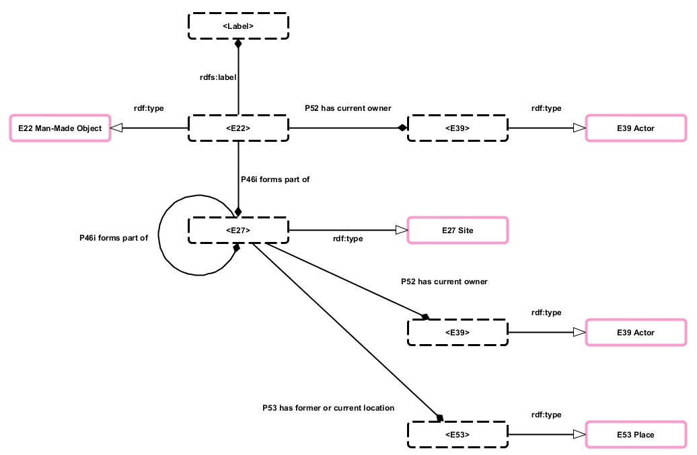
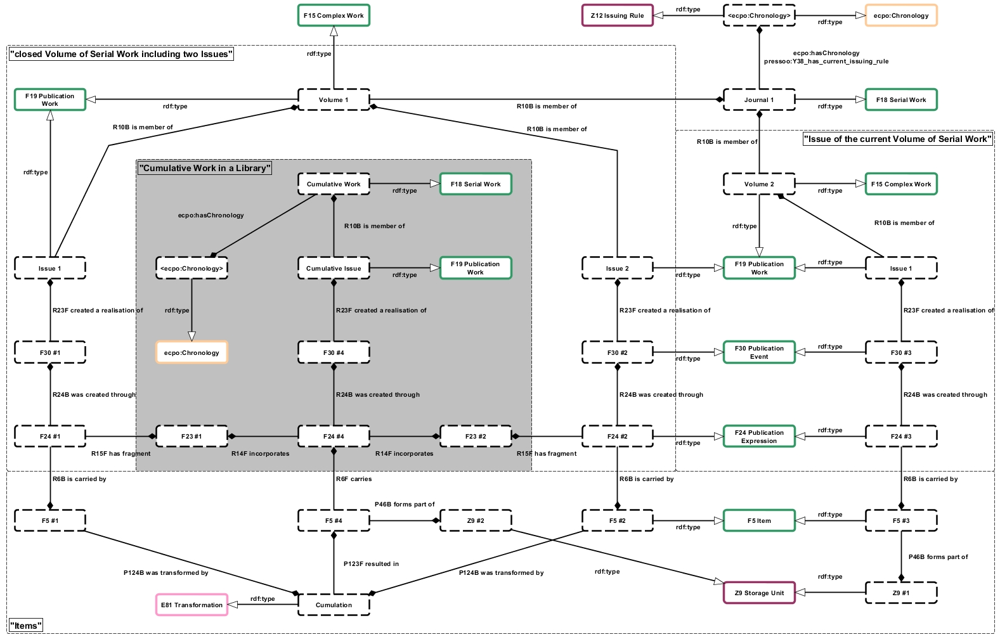

# Library Holdings as Linked Data

Posted on 22. November 2013 by Hans-Georg Becker	

Translated by André Hagenbruch / [Deutsche Version](./bestandsnachweise-von-bibliotheken-als-linked-data.md)

In his blog post [“Local library data in the new global framework”](https://commonplace.net/2012/01/local-library-data-in-the-new-global-framework/) Lukas Koster was spot on when he noted:

>    It doesn’t really make sense if all libraries in the world publish identical metadata side by side, does it?\
>    In essence only really unique data is worth publishing. You link to the rest. 

Among the few examples for the typical library to publish unique Linked Open Data are special collections and the increasingly important field of research data. But the one unique data resource that all libraries have in common is holdings information. As more and more bibliographic data is fed to WWW search engines by publishers, holdings information is an increasingly relevant source for networked and mobile applications.

Small wonder that there already are several approaches to modelling holdings. Among these are:

*    [Holdings Ontology](https://dini-ag-kim.github.io/holding-ontology/holding.html) in the context of the German DINI-KIM-WG (s. [Wiki of the DINI-KIM-WG](https://wiki.dnb.de/pages/viewpage.action?pageId=43523047))
*    [Library Holdings RDF Vocabulary](https://homepages.inf.ed.ac.uk/v1wwaite/2011/06/holdings.html) / EDINA (EDINA is the [Jisc](https://www.jisc.ac.uk/)-designated national data centre at the [University of Edinburgh](https://www.ed.ac.uk/). ))
*    [Holdings via Offer](https://www.w3.org/community/schemabibex/wiki/Holdings_via_Offer) in the context of the [Schema Bib Extend Community Group](https://www.w3.org/community/schemabibex/wiki/Main_Page)

If you look at my earlier posts in this blog, I have already shown the flexibility and expressiveness of CRM, FRBRoo and PRESSoo. These articles mostly focused on the desciption of bibliographic objects and concepts and only hinted at their usefulness for holdings information. But the ontologies of the CRM universe in conjunction with the concepts from [DAIA](https://gbv.github.io/daiaspec/daia.html) are very well suited to describe holdings information.

## WEM + I in the CIDOC CRM Universe

Taking the University Library Dortmund as a member of the hbz library network I will show how the concepts work, expression, manifestation (WEM), and items (I) are being distributed among these two organisations.[^1] Whereas the library co-operative takes care of both the bibliographic description of the works, expressions, and manifestations as well as of its own collection descriptions, University Library Dortmund primarily documents their local holdings and builds availability services around them. Thus we avoid the aforementioned process of repeatedly publishing of identical data.

[^1]: The catalog of the NRW library network is being operated by the Hochschulbibliothekszentrum NRW (hbz) and is an effort of the participating libraries cataloging into a central integrated library system. The data captured there are then being replicated to the local library systems.

The following diagram illustrates the connection between these two services. It’s limited to the major components and builds on the models described in [FRBRoo — eine Anwendung](../../02/15/frbroo-eine-anwendung.md)[^2]. 

[^2]: currently only in German


On the right side of the diagram you can see the actual holdings which are being modeled by the concept `F5 Item` from FRBRoo. Moreover, PRESSoo offers a suitable item for journal holdings, i.e. `Z9 Storage Unit`. The CRM extension CRMdig offers a suitable model for the presentation of digital objects on the level of exemplars.

## Holdings information

To describe holdings information with the CRM I use the properties of the exemplar entity’s parent. It holds that:

*    `F5 Item` `subClassOf` `E84 Information Carrier` `subClassOf` `E22 Man-Made Object`
*    `Z9 Storage Unit` `subClassOf` `E22 Man-Made Object`
*    `D13 Digital Information Carrier` `subClassOf` `E84 Information Carrier` `subClassOf` `E22 Man-Made Object`
*    `E22 Man-Made Object` `subClassOf` `E19 Physical Object` `subClassOf` `E18 Physical Thing`

Usually such physical objects are being kept in a certain location and can eventually be made available to the user. These locations can be described with CRM concept `E27 Site`. Quoting the CRM:

 >   In contrast to the purely geometric notion of `E53 Place`, this class describes constellations of matter on the surface of the Earth or other celestial body, which can be represented by photographs, paintings and maps.

Thus we can make statements about cohesion or ownership with respect to locations like branches, sections, departments, or stacks using `E27 Site`. To this end we can employ the following relations of the CRM (`E27 Site` `subClassOf` `E18 Physical Thing`):

*    `E18 Physical Thing` `P46 is composed of (forms part of)` `E18 Physical Thing`
*    `E18 Physical Thing` `P52 has current owner (is current owner of)` `E39 Actor`
*    `E18 Physical Thing` `P58 has section definition (defines section)` `E46 Section Definition`



**Example 1:** The FRBR family of conceptual models

```
<http://data.ub.tu-dortmund.de/resource/item/20129967> [
  a frbroo:F5_Item ;
  rdfs:label "A 12726" ;
  ecrm:P52_has_current_owner <http://lobid.org/organisation/DE-290> ;				
  ecrm:P46i_forms_part_of [
	a ecrm:E27_Site ;
	ecrm:P58_has_section_definition [
		a ecrm:E46_Section_Definition ;
		rdfs:label "Second Floor"
	]  ;
	ecrm:P46i_forms_part_of [
		a ecrm:E27_Site ;
		ecrm:P58_has_section_definition [
			a ecrm:E46_Section_Definition ;
			rdfs:label "Central Library"
		] ;
		ecrm:P46i_forms_part_of [
		  a ecrm:E27_Site ;
		  ecrm:P58_has_section_definition [
			a ecrm:E46_Section_Definition ;
			rdfs:label "TU Dortmund, University Library"
		  ] ;
		] ;
	] ;
  ] ;  
] .
```

Here we describe the item with the call number “A 12726” located on the second floor of the central library of the University Library Dortmund. We could enrich the description of the central library by adding for instance geo information as it is one of eight sites making up the entire University Library. This geo information then describes an `E53 Place` linked to a `P53 has former or current location`.

Ongoing serials (`F18 Serial Work`) or journals as their special case have to be viewed from a point of view of storage practices. With the exception of the most recent isuues, items of journal issues are mostly available as a series of bound units. Usually these series are not further specified, but hold a common call number.[^3] 

[^3]: The volumes of “simple series” can be described as objects of ‘classic book format’ which are not being bound as books in frequent intervals. Thus, they won’t be considered in this article.

The following diagram shows both the most current issue in its original binding and the result of the binding process and its relation to `Z9 Storage Unit`. By transforming the items to a new object the latter becomes an item of a new cumulative Publication Work. This Publication Work in turn is part of an ongoing serial work of type series.



The holdings information is now distributed on two objects:

*    `Z9 Storage Unit` is being described similarly to `F5 Item` in example 1.
*    The holdings history is being assigned to the newly created `F18 Serial Work` by means of ECPO. 
    
[^4]: see also: [“PRESSoo und ECPO – Zwei weitere Ontologien zur Beschreibung von fortlaufenden Sammelwerken”](../08/pressoo-und-ecpo-zwei-weitere-ontologien-zur-beschreibung-von-fortlaufenden-sammelwerken.md) (currently only in German)

In the following example the journal’s holdings information is being illustrated with a partial `Z9 Storage Unit`, leaving out the chronology.

**Example 2:** Bibliotheksdienst\
According to the model outlined above this journal has two `Z9 Storage Units`, as it has been acquired by two branches of the University Library Dortmund.

```
<http://data.ub.tu-dortmund.de/resource/storageunit/ZA_377> [
  a pressoo:Z9_Storage_Unit ;
  rdfs:label "ZA 377" ;
  ecrm:P52_has_current_owner <http://lobid.org/organisation/DE-290> ;	
  ecrm:P46I_forms_part_of [
	a ecrm:E27_Site ;
	ecrm:P58_has_section_definition [
		a ecrm:E46_Section_Definition ;
		rdfs:label "Basement Level 1"
	]  ;
	ecrm:P46I_forms_part_of [
		a ecrm:E27_Site ;
		ecrm:P58_has_section_definition [
			a ecrm:E46_Section_Definition ;
			rdfs:label "Central Library"
		] ;
		ecrm:P46I_forms_part_of [
		  a ecrm:E27_Site ;
		  ecrm:P58_has_section_definition [
			a ecrm:E46_Section_Definition ;
			rdfs:label "TU Dortmund, University Library"
		  ] ;
		] ;
	] ;
  ] ;  
] . 
```
```
<http://data.ub.tu-dortmund.de/resource/storageunit/Bibliotheksdienst> [
  a pressoo:Z9_Storage_Unit ;
  rdfs:label "Bibliotheksdienst" ;
  ecrm:P52_has_current_owner <http://lobid.org/organisation/DE-290> ;				
  ecrm:P46I_forms_part_of [
	a ecrm:E27_Site ;
	ecrm:P58_has_section_definition [
		a ecrm:E46_Section_Definition ;
		rdfs:label "R. 501"
	]  ;
	ecrm:P46I_forms_part_of [
		a ecrm:E27_Site ;
		ecrm:P58_has_section_definition [
			a ecrm:E46_Section_Definition ;
			rdfs:label "Bibl. Sozialforschungsstelle"
		] ;
		ecrm:P46I_forms_part_of [
		  a ecrm:E27_Site ;
		  ecrm:P58_has_section_definition [
			a ecrm:E46_Section_Definition ;
			rdfs:label "TU Dortmund, University Library"
		  ] ;
		] ;
	] ;
  ] ;  
] .
```

## Services for Items

Holdings information decoupled from pertinent services of the organisation isn’t much worth in the Linked Open Data Cloud. Only through coupling items with services such as loan can we offer surplus values that are not normally available through the bibliographic description alone.

As I already said in my previous post, currently a few micro ontologies dealing with the modelling of library services and bibliographic metadata in the linked data context are being developed by the German library community. To describe these services and statuses, we can use [DAIA](https://gbv.github.io/daiaspec/daia.html), [DSO](https://gbv.github.io/dso/dso.html) and [SSSO](https://gbv.github.io/ssso/ssso.html).

The following diagram shows the linkage of the Document Service Ontology to the `Z9 Storage Unit` via DAIA. For this we have to assume that the concept of Document in DSO and DAIA is compatible with `Z9 Storage Unit`.[^5] 

[^5]: The DSO specification says: ‘The set of documents is not limited to a specific class […]’. Thus, the assumption holds true. The DAIA specification would have to be extended insofar as it only considers frbr:items valid at this point.


The linked Document Services are being described by the Simple Service Status Ontology. Thus, we can make statements such as ‘Item A is unavailable until date X.’

**Example 3:** loanable item with property daia:availableFor

```
<http://data.ub.tu-dortmund.de/resource/item/20129967> [
  a frbroo:F5_Item ;
  rdfs:label "A 12726" ;
  daia:availableFor [
    a dso:Loan ;
  ] ;
  ecrm:P52_has_current_owner <http://lobid.org/organisation/DE-290> ;				
  ecrm:P46I_forms_part_of [
	a ecrm:E27_Site ;
	ecrm:P58_has_section_definition [
		a ecrm:E46_Section_Definition ;
		rdfs:label "Second Floor"
	]  ;
        ...
  ] ;  
] .
```

**Example 4:** issue of a serial work available for presentation and interlibrary loan

```
<http://data.ub.tu-dortmund.de/resource/storageunit/ZA_377> [
  a pressoo:Z9_Storage_Unit ;
  rdfs:label "ZA 377" ;
  daia:unavailableFor [
    a dso:Loan ;
  ] ;
  daia:availableFor [
    a dso:Presenation ;
  ] ;
  daia:availableFor [
    a dso:Interloan;
  ] ;
  ecrm:P52_has_current_owner <http://lobid.org/organisation/DE-290> ;	
  ecrm:P46I_forms_part_of [
	a ecrm:E27_Site ;
	ecrm:P58_has_section_definition [
		a ecrm:E46_Section_Definition ;
		rdfs:label "Basement Level 1"
	]  ;
        ...
  ] ;  
] .
```

## Conclusion

I have shown that we can make meaningful statements about holdings information using the existing ontologies and that there is no need for developing new vocabularies. As an afterthought, we might even also describe acquisition information within the CIDOC CRM framework. The simplest approach would be to use the concept `E8 Acquisition Event` to model an acquisition event and to describe it via EDIFACT data as an `E31 Document`.

# Feedback

Vladimir Alexiev says on 22. Dezember 2013 at 19:46:

> Nice specific post!\
> But I don’t think that “Item forms part of a Site” is quite in the spirit of things.\
> frbroo:F5_Item ecrm:P46i_forms_part_of [a ecrm:E27_Site]\
> I think you should use Collection instead of Site.

Hans-Georg Becker says on 10. August 2014 at 13:07:	

> Thanks for your feedback!\
> Of course you are right. The item is part of a collection and therefore frbroo:F5_Item ecrm:P46i_forms_part_of [a ecrm:E78_Collection] is right.\
But my approach is to look at the part of relation in two ways. In the sense of “location” of the item I have used ecrm:E27_Site. As I have thought about it yet I should better use ecrm:E25_Man-Made_Feature which is a superclass of ecrm:E27_Site which is described in the CIDOC CRM as “class comprises physical features that are purposely created by human activity, such as scratches, artificial caves, artificial water channels, etc.”. Thus a floor or a section of it is a ecrm:E25_Man-Made_Feature.


