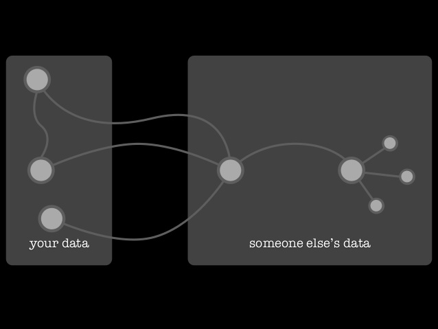
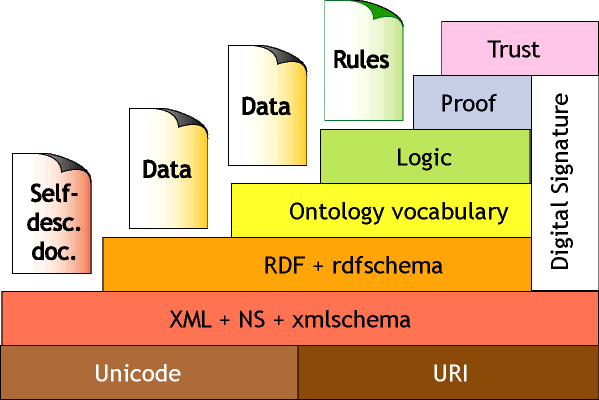
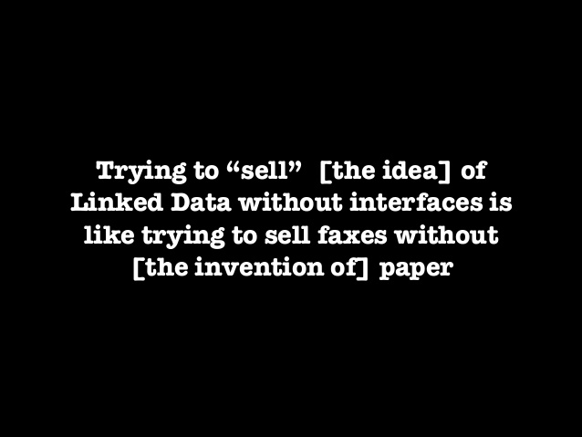

# “In LOD we trust” – Ein Bericht von der SWIB13

Veröffentlicht am 8. August 2014 von Hans-Georg Becker	

\
The LODLAM Mercury von Hans-Georg Becker steht unter einer Creative Commons Namensnennung 4.0 Unported Lizenz.

***

Wie die Zeit vergeht … Ich habe es endlich geschafft, auch meine Eindrücke von der SWIB 13 in Worte zu fassen. Viel Spaß damit!

<s>In diesem</s> Im letzten Jahr feierte die Konferenz “Semantic Web in Bibliotheken” – kurz SWIB – in Hamburg ihren fünften Geburtstag.[^1]
Ich hatte für mich den Schwerpunkt auf die Bereiche Datenanalyse, Linking und Distribution gelegt, da es für mich jetzt, nach der Zeit der Datenmodellierung, in die Phase der konkreten Datenerzeugung und Veröffentlichung geht.

[^1]: s. [Website](https://swib.org/swib13/)<s>; Twitterarchiv</s>

# Vorkonferenz/Workshops

Schon bei der Anmeldung zur SWIB hatte ich die schwere Entscheidung zu treffen, welchen Workshop ich besuchen soll. Zum einen waren da die beiden Workshops zur Datenanalyse und -aufbereitung mittels Catmandu[^2] bzw. [MetaFacture](https://culturegraph.github.io/), deren Verwendung unsere Datenqualität erheblich verbessern könnten. Zum anderen war da der Workshop zum Thema Provanance Metadata, dessen Inhalte für die Publikation und Verwendung von Linked Data relevant sind.
Entschieden habe ich mich letztlich für den Workshop zu [“Analysis of Library Metadata with Metafacture”](https://swib.org/swib13/programme.php#abs131) von [Christoph Böhme](https://swib.org/swib13/speakers.php#da021f69c644792ed18a6a0eecc78be5), da die Datenanalyse und -aufbereitung der nächste notwendige Schritt vor der Veröffentlichung der Daten darstellt. Für MetaFacture habe ich mich entschieden, weil das Tool zum einen im Projekt [lobid.org](https://lobid.org/about) des hbz und zum anderen von [CultureGraph](https://www.culturegraph.org/) verwendet wird und beide Projekte bzw. Plattformen für uns als UB Dortmund eine gewisse Relevanz haben.

[^2]: [Webseite des LibreCat-Projekts inkl. Backbone Catmandu](https://librecat.org/)

MetaFacture ist ein Tool zur Analyse und Aufbereitung von Metadaten. Entwickelt wurde das Tool im Rahmen des Projekts “CultureGraph” und setzt auf Einfachheit in der Anwendung. Es besteht dabei aus zwei Komponenten: Flux und Metamorph.
Die Idee des Werkzeugs ist, dass Daten durch sogenannte Pipes geleitet werden, dessen Module für kleine Aufgaben zuständig sind.
Das folgende Beispiel einer Flux-Datei illustriert diese Idee:

```
"in-file"
|open-file
|decode-pica
|morph("morph.xml")
|encode-json
|write("out-file");
```
Im Schritt morph wird die eigentliche Arbeit an den Daten definiert. Dazu dient eine XML-Datei, die mittels einfacher Befehle Daten manipulieren kann.
```
<?xml version="1.0" encoding="UTF-8"?>
 <metamorph xmlns="http://www.culturegraph.org/metamorph"
  xmlns:xsi="http://www.w3.org/2001/XMLSchema-instance" 
  version="1" entityMarker=".">	
  <rules>
    <combine name="" value="${ID}, ${Lastname}, ${Firstname}, ${Birthdate}, ${Birthplace}" flushWith="record">
      <data source="_id" name="ID" />
      <data source="Firstname" />
      <data source="Lastname" />
      <data source="Birthdate" />
      <data source="Birthplace" />
    </combine>
  </rules>	
 </metamorph>
```

MetaFacture liefert schon ein paar Decoder und Encoder mit, sodass beispielsweise MARC-Daten einfach in Triples umgewandelt werden können.

Der Workshop hatte diese Bezeichnung wirklich verdient. Es wurde in kurzen und mit jeder Einheit inhaltlich anspruchsvolleren Abschnitten die Funktionsweise erläutert. Zwischen den Theorieabschnitten war sehr viel Zeit für praktische Übungen. Der Workshop kann daher nur als gelungen bewertet werden.

## “Bringing People to Linked Data”

Der erste Tag der Hauptkonferenz startete mit einer ausgezeichneten Keynote von Dorothea Salo[^3].\
Sie thematisierte in ihrem sehr unterhaltsamen Vortrag “Soylent SemWeb Is People! Bringing People to Linked Data” das Verhältnis zwischen Bibliothekaren und Linked Data insbesondere aus Sicht der Ausbildung. Sie kam dabei zu dem Schluss, dass für die Akzeptanz von Linked Data in Bibliotheken dringend Anwendungen entwickelt werden müssen, um den Bibliothkaren aber auch den Entscheidern das Thema näher zubringen und die Vorteile aufzuzeigen (dies gilt insbesondere für öffentliche und “One-Person”-Bibliotheken[^4]. Es ist für Linked Data nicht sonderlich förderlich, wenn hier die gleichen Fehler wie bei der Einführung von XML oder Institutional Repositories gemacht werden. Es wurde in ihrer Keynote nochmals sehr deutlich, dass die Sicht der Anwender der neuen Tools essentiell für den Erfolg der Produkte sind.[^5]\
In ihren Ausführungen legte Salo den Fokus bei Linked Data ganz deutlich auf die Generierung neuer Daten und nicht nur auf die Veröffentlichung von Altdaten als Linked Data.
Dorothea Salo hat es mit Ihrer Keynote geschafft, dass das folgende Progeamm der SWIB immer wieder auf dieses Forderung bezug genommen hat, wobei sich deutlich gezeigt hat, dass die geforderte Richtung bereits eingeschlagen wurde.

[^3]: [@LibSkrat](https://twitter.com/LibSkrat), [zur Person](https://swib.org/swib13/speakers.php#c2c4f28004930606b4fb3c0170d3a7f6), [Abstract](https://swib.org/swib13/programme.php#abs166)

[^4]: In öffentlichen, Museums- oder Archiv-Bibliotheken und in OPLs sind häufig sogar MARC und MAB zu “oversized”. Gerade hier kann mit neuen Systemen auf Linked Data-Basis viel erreicht werden. Der Vortrag [“The ‘OpenCat’ Prototype: Linking Public Libraries to National Datasets”](https://swib.org/swib13/programme.php#abs104) von [Agnès Simon](https://swib.org/swib13/speakers.php#8bfce8a7bf40255174b22fbd491d1d90) (Bibliothèque nationale de France) stellte auch genau diese Gruppe von Bibliotheken in den Fokus.)

[^5]: Als Beispiele nannte Salo, dass Institutional Repositories ohne die Wissenschaftler entwickelt und monierte, dass bisher Linked Data ohne die Bibliothekare stattfand, die die Daten letztlich erzeugen müssen bzw. sollten.

## “From Cataloging to Catalinking”

In seinem Vortrag “Linked Data for Libraries: Great Progress, but What Is the Benefit?” betrachtete Richard Wallis (OCLC)[^6] das Bibliotheksnutzerverhalten und stellte fest, dass Linked Data den Bibliotheken hilft, die Nutzerinnen und Nutzer dort zu erreichen, wo sie ihr Bedürfnis nach Informationen (zu) stillen (versuchen). Er stellte unter anderem die Frage, wie nach einem Wikipedia-Artikel gesucht wird. Nicht sonderlich überraschend ist die Antwort:

>    Ich geben meinen Suchbegriff in Google ein und ergänze um den Begriff ‘wikipedia’. Der erste Treffer ist dann das Gesuchte.

Wenn man sich diese Aussage durch den Kopf gehen lässt, stellt man fest, dass die aktuellen Entwicklungen in den Bibliotheken rund um die Discovery Systeme nicht zukunftsweisend sind. Die Discovery Systeme in der heutigen Form sind somit maximal eine alternativlose Brückentechnologie auf dem Weg der Bibliotheken ins Web. Um so wichtiger ist die Aufgabe von Bibliotheken bzw. Bibliothearinnen und Bibliothekaren die releveanten Daten als Linked Open Data für das Semantic Web bereitzustellen, also “From Cataloging to Catalinking”.\
Wallis stellte in diesem Zusammenhang die [“schema.org”](schema.org)-Initiative  vor, in der sich mittlerweise ein Untergruppe mit der Darstellung von bibliographischen Informationen beschäftigt.[^7]\
Die Frage nach einer möglichen Kollision mit der BIBFRAME-Initiative beantwortete Wallis mit der Feststellung, dass im Linked Data-Kontext verschiedene Modelle miteinander kollaborieren und nicht konkurieren.

Die aktuellen Entwicklungen rund um BIBFRAME wurden in der folgenden Session von [Lars G. Svensson](https://swib.org/swib13/speakers.php#e5a33e86cb002d0afd7ba3c228ae33bc) vorgestellt.[^8]

[^6]: [@rjw](https://twitter.com/rjw), [zur Person](https://swib.org/swib13/speakers.php#1069a3d733aa684c13bb2f27c547df39), [Abstract](https://swib.org/swib13/programme.php#abs108)

[^7]: [W3C Schema Bib Extend Community Group](https://www.w3.org/community/schemabibex/)

[^8]: [Abstract](https://swib.org/swib13/programme.php#abs103)

## “Decentralisation, Distribution, Disintegration”

Mit der Sicht von Richard Wallis auf bibliographische Daten ist klar, dass Linked Data ein dezentralisiertes System ist und somit eher “small data” als “big data”. Auch [Martin Malmsten](https://swib.org/swib13/speakers.php#90cdf2f589effbecd5e8b5b1f6dbc0d2) stellte in seinem Beitrag [“Decentralisation, Distribution, Disintegration – towards Linked Data as a First Class Citizen in Libraryland”](https://swib.org/swib13/programme.php#abs136) diesen Ansatz in den Vordergrund.



## “In LOD we trust”

Der Workshop zum Thema Provanance Metadata wurde nun schon zum zweiten Mal bei der SWIB angeboten. Während der SWIB zeigte sich in vielen Bereichen, dass die Ebene der Vertrauenswürdigkeit im “Semantic Web Layer Cake” immer mehr in den Fokus rückt.



Die beiden letztgenannten Beiträge zusammengefasst ergeben somit die Erkenntnis, dass unter der Tatsache “Linked Data = Small Data” die Bereitstellung von “Provenance Metadata” eine notwendige Bedingung für “Trust” in der Linked Open Data Cloud und im Semantic Web ist.

## Fazit

Die Konferenz war super 🙂 Die Entwicklung von einer lokalen zu einer internationalen Konferenz zeigt, wie wichtig das Thema “Semantic Web” bzw. “Linked Data” in Bibliotheken ist und das die Bibliothekswelt eine entscheidene Rolle darin spielt.

Um Entscheider und Bibliothekare für das Thema zu begeistern sind dringend konkrete Anwendungen notwendig, die die Vorteile näher bringen und nicht auf RDF-Level agieren. Allerdings handelt es sich hierbei um ein Henne-Ei-Problem: es müssen erst Modelle und Daten erzeugt werden, um erste Anwendungen zeigen zu können; es werden aber nur Ressourcen dazu geschaffen, wenn man zeigen kann, warum Linked Data wichtig und nützlich ist.



Es kann den Teilnehmern der Tagung und anderen Kolleginnen und Kollegen nicht hoch genug angerechnet werden, dass sie mit soviel Engagement und ohne große Ressourcen die Vorarbeiten leisten.

Weitere lesenswerte Tagungsberichte:

*    Lukas Koster: [“Linked Data or die!”](https://commonplace.net/2013/12/linked-data-or-die/). In: CommonPlace.Net – Library2.0 and beyond.
*    Rurik Greenall: [“SWIB13: semantic web in bibliotheken 2013”](https://brinxmat.wordpress.com/2013/11/28/swib13-semantic-web-in-bibliotheken-2013/). In: Brinxmat’s blog.

***

